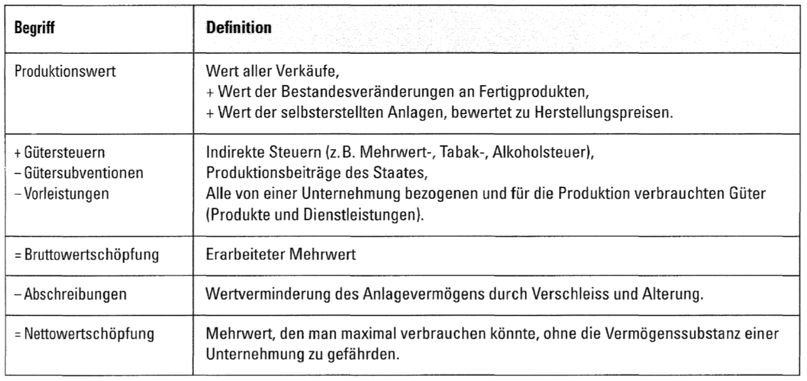
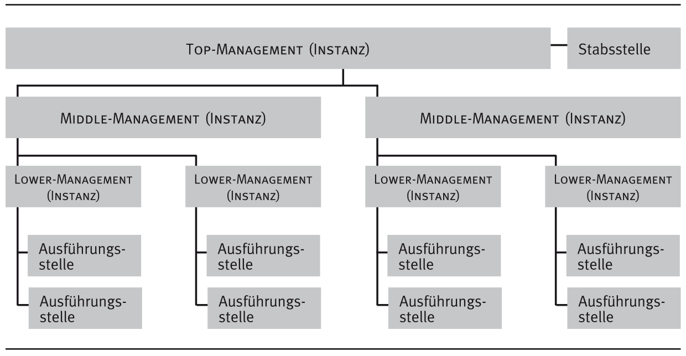
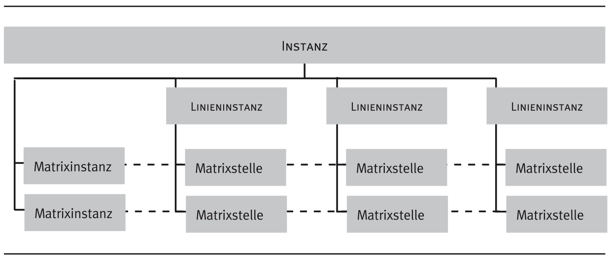
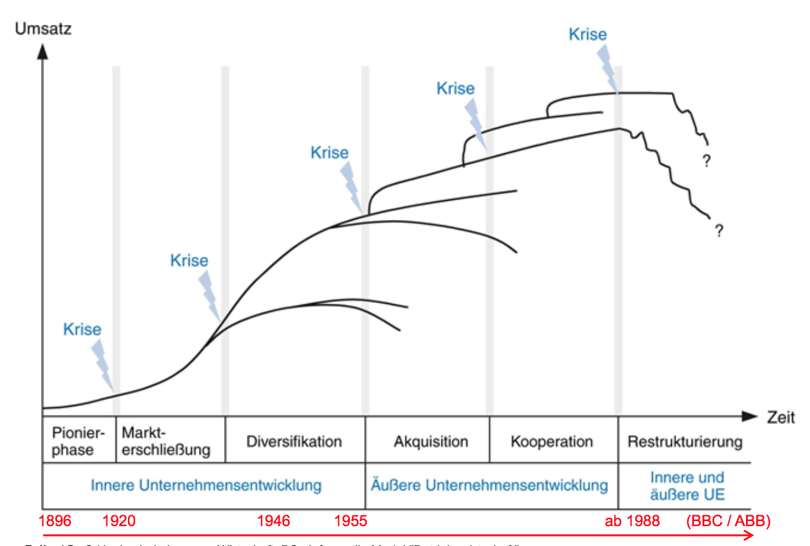

# Braindump MEP I.BA BW.H16 (Lösungen)

Mögliche Lösungen zum Braindump Dokument von der Studentbox. Keine Garantie auf Korrektheit.

## 1 Unternehmung und Umwelt

**a.) Die Begriffe Wirtschaftlichkeit und Rentabilität unterscheiden und Faktoren berechnen.**

Es handelt sich bei beiden um Formalziele (Erfolgsziele). 

* **Wirtschaftlichkeit**: 
	* Verhältnis zwischen dem erreichten Erfolg und dem dafür erforderlichen Aufwand (CHF). Es drückt das Ökonomische Prinzip in Zahlen aus.
	* $Wirtschaftlichkeit = \frac{Ertrag}{Aufwand} = CHF$
	* wenn > 1, spricht man von einem wirtschaftlichen Unternehmen
* **Rentabilität**: 
	* Verhältnis zwischen Gewinn und eingesetztem Kapital (%). Beispiele: Kapitalrentabilität, Umsatzrentabilität, etc.
	* $Umsatzrentabilität = \frac{Gewinn}{Umsatz} = \%$
	* wenn > 1, Unternehmen geht effizient mit bereitgestelltem Kapital um

Auch wichtig zu kennen sind: 

* Effizienz (Verhältnis zwischen Input und Output)
* Effektivität (Zielerreichungsgrad)
* Produktivität (nicht finanziell orientierte Verhältniszahl)

---

**b.) Zu ausgewählten Anspruchsgruppen aus dem St. Galler Management-Modell anhand eines Unternehmens verschiedene Ansprüche auflisten.**

Person/Gruppe mit berechtigten Interesse am Verlauf/Ergebnis eines Prozesses oder Projektes.

* Eigentümer (Dividenden)
* Management (Salär, Selbstverwirklichung, Reputation, Image)
* Mitarbeiter (Förderung, Lohn, Aufstiegsmöglichkeiten, Arbeitsplatzsicherheit)
* Fremdkapitalgeber (sichere Kapitalanlage, Verzinsung, Vermögenszuwachs)
* Lieferanten (Bonität, Bezug von Ware, langfristige Verträge)
* Kunden (Geschwindigkeit, Service, Zuverlässigkeit)
* Konkurrenz (Fairer Wettbewerb, Preisabsprachen, Kooperationen)
* Staat und Gesellschaft (Arbeitsplatzsicherheit, Umwelt, Regeln, Steuern)

---

**c.) Anhand einer fiktiven Firma (”Degitec“ Online-Shop, haha) erklären was negative Wertschöpfung bedeutet und wie sie zustande kommt.**

Wertschöpfung: Differenz zwischen dem Wert der an den Markt abgegebenen Leistungen und den vom Unternehmen übernommenen Vorleistungen.

$Wertschöpfung = \textit{abgegebene Leistungen} - Vorleistungen$

Berechnung: 

* Wir gehen davon aus, dass der Online-Shop keine eigenen Produkte herstellt, weswegen die Berechnung der selbsterstellten Anlagen wegfällt
* Indirekte Steuern wären zum Beispiel Mehrwertsteuern
* Gütersubventionen fallen wahrscheinlich weg
* Vorleistungen: Datenbank herstellen, Zahlungssystem, Transportkosten, Postgebühren, Anwaltskosten, gewerbliche Mieten, ...
* Abschreibungen: Abgelaufenen oder beschädigte Waren, Abschreibungen in der Logistik, ...

---

## 2 Marketing

**a.) Die verschiedenen Marktgrössen erklären anhand eines Beispielprodukts und einschätzen/begründen ob der Markt gesättigt ist.**

* Marktpotential (Maximale Aufnahmefähigkeit des Marktes)
* Marktvolumen (realisierter oder geplanter Umsatz)
* Marktanteil (Anteil des Unternehmens am Marktvolumen)
* absoluter Marktanteil (alle Produkte durch meinen Marktanteil)
* relativer Marktanteil (verglichen mit dem grössten Marktanteil)
* Marktführer (Wenn grösster Marktanteil)
* Marktsättigung (Marktvolumen durch Marktpotential)

Beispiel: 

In der Schweiz leben etwa 8 Mio. Menschen. Davon sind etwa 75% bezüglich Alter und Gesundheit potenzielle Golfspieler. Weil jeder Golfspieler theoretisch unendlich viele Golfbälle besitzen kann, macht es keinen Sinn, die Kapazität in Golfbällen zu berechnen. Es reicht, die Marktkapazität in Spielern zu berechnen. 

Von diesen 6 Mio. Menschen (75% von 8 Mio.) können sich 20% das Golfspielen finanziell leisten. Damit beträgt das Marktpotenzial 1.2 Mio. Golfspieler (20% von 6 Mio.).
Wenn jeder Golfspieler im Durchschnitt pro Jahr 36 Bälle braucht (die entweder vom Spieler selber oder vom Golfplatz für die Benutzung auf der Driving Range gekauft werden), entspricht das einem Marktpotenzial von 43.2 Mio. Golfbällen. Bei einem Durchschnittspreis von CHF 1.– beträgt das Marktpotenzial entsprechend 43.2 Mio. CHF.

Tatsächlich spielen in der Schweiz etwa 80 000 Menschen Golf, was ca. 1% der Wohnbevölkerung
entspricht. Diese Zahl ist höher als in Deutschland (0.67%), aber tiefer als in Schottland (4.81%), England (1.5%) und Österreich (1.26%). Diese 80 000 Golferinnen und Golfer brauchen pro Jahr 2 880 000 Golfbälle (Marktabsatz) im Wert von CHF 2 880 000.– (Marktumsatz).

Die Firma Swiss GolfPro verkauft jährlich 210 000 Golfbälle im Wert von CHF 250 000.–. Damit
beträgt ihr mengenmässiger Marktanteil 7.29% (210 000 / 2 880 000) und ihr wertmässiger (absoluter) Marktanteil 8.6% (CHF 250 000.– / CHF 2 880 000.–). Der Sättigungsgrad des Markts beträgt 6.67% (2 880 000 / 43 200 000 Golfbälle). Wenn von den 80 000 Golfern 50 000 in einem Jahr mindestens einmal Golfbälle gekauft haben, beträgt die Penetration für dieses Jahr 62.5% (50 000 / 80 000), wobei hier die Käufe durch die Golfplätze nicht berücksichtigt sind. Bei den Golfplätzen beträgt die Penetration 100%, weil jeder Golfplatz mindestens einmal im Jahr Golfbälle kauft. [Quelle: https://www.compendio.ch/~/media/Files/Kalaidos-Bildungsgruppe-Schweiz/Compendio/Projekte/Marketing2014/Marketingkonzept.pdf]

---

**b.) Von Mineralwasser den Grundnutzen und mögliche Massnahmen zur Schaffung oder Erhöhung von Zusatznutzen beschreiben.**

* Grundnutzen: Durst löschen
* Zusatznutzen: gesundheitsfördernd, sportlich, Freiheitsgefühl

Mögliche Massnahmen zur Schaffung oder Erhöhung des Zusatznutzen:

* Bessere Public Relations
* Schönere Verpackung
* Kultur um Produkt erschaffen
* Mit Herkunft werben
* Gewisse Mineralien übertrieben bewerben
* Werbung

---

**c.) Erklären, was das Ziel von Preisdifferenzierung ist und am Beispiel von zwei Produkten aufzeigen wie das konkret umgesetzt wird.**

* Horizontal (Unterschiedliche Preise für verschiedene Gruppen)
    * Unterteilung (Studenten, AHV, Mitglieder eines Vereins)
    * Beispiele (Kino, Theater, Schwimmbad)
* Vertikal (Unterteilung in Teilmärkte)
    * Unterteilung (zeitlich, räumlich)
    * Beispiele (Strom in der Nacht, Hardcover vs Softcover)

Auch 1./2. Klasse SBB oder für sparsamere Einkäufer M-Budget.

---

## 3 Strukturen

**a.) Einige Grundannahmen von klassischen Organisationstheorien auflisten und begründen, warum diese inzwischen als überholt gelten.**

* Emotionen stören
* Koordination durch Anleitung
* Hierarchische Delegation
* Effizienz durch Regeln
* Spezialisierung
* Kontrolle ist wichtig
* Geld ist Arbeitsmotivation

Die Wünsche und Vorstellung der Mitarbeiter ändert sich fortlaufend. Verschiedene neue Denkensweisen haben sich verbreitet und die Unternehmen müssen sich an diese Anpassen. Früher stand zum Beispiel Heim und Familie im Vordergrund, heute vielleicht eher Work-Life-Balance.

---

**b.) Es folgt eine Fallstudie zu einem Kleinunternehmen. Anhand des Firmenbeschriebs und einer Mitarbeiterliste ein Organigramm der Primärstruktur machen und Schnittstellenkonflikte darin aufzeigen.**

* Einliniensystem
	* Jeder Mitarbeiter nur einen Vorgesetzten
	* Vorteil: klare Weisungsbefugnisse
	* Nachteil: Lange Wege, die die Einhaltung des Dienstwegs in diesem System verursacht

	

* Mehrliniensystem
	* Eine untergeordnete Stelle kann von mehreren übergeordneten Stellen Weisungen erhalten
	* Vorteil: kürzester Weg (Mitarbeiter kann sich direkt an Betroffenen wenden)
	* Nachteil: Gefahr von Kompetenzkonflikten und dem großen Bedarf an Führungskräften
	* Kleinere Unternehmen (Handwerksbetriebe)

* Matrixsystem
	* Form der Mehrlinienorganisation. Auf derselben hierarchischen Ebene zwei unterschiedliche Gliederungsprinzipien (z. B. Verrichtungs- und Objektgliederung) kombiniert. Vertikal: Linieninstanz, Horizontal: Matrixinstanz
	* Vorteil: kürzere Kommunikationswege, höhere Flexibilität, direkter Zugang zu relevanten Spezialisten
	* Nachteil: Kompetenzkonflikte der Führungsinstanzen über Verwendung der Arbeitsleistung der Matrixstelle

---

## 4 Veränderungsmanagement

**a.) Die vier Handlungsfelder von Change Management auflisten.**

* Strategie (Vision, Leitbild, Geschäftsstrategie)
* Kultur (Führung, Kommunikation)
* Technologie (Methoden, verfahren)
* Organisation (Struktur, Prozesse)

---

**b.) Einige Aussagen zum Phasenmodell der Unternehmensentwicklung von Knut Bleicher als richtig oder falsch beurteilen.**

* Innere Unternehmensentwicklung
    * Pionierphase (Startup-Phase)
    * Markterschliessung (Kapital wird gebraucht, häufig funktionale Organisation)
    * Diversifikation (neue Erfolgsmöglichkeiten)
* Äussere Unternehmensentwicklung
    * Akquisition (andere Unternehmen aufkaufen, Kampf der Kulturen)
    * Kooperation (strategische Allianzen, gemeinsame Wertevorstellungen)
* Innere- und Äussere Unternehmensentwicklung
    * Restrukturierung (profitable Geschäftsfelder, gesnundschrumpfen)

---

**c.) Verschiedene Massnahmen für den Umgang mit Widerstand gegen Veränderungen auflisten.
Die verschiedenen Personentypen im Wandel an Beschreibungen zuordnen.**

Gründe für Widerstand:

* persönliche Vorbehalte
* Mangel an Kommunikation
* Fehlendes Vertrauen
* Fehlende Motivation

Arten von Widerstand:

* Rationaler Widerstand (Sachlich Vor- und Nachteile)
* Politischer Widerstand (Einfluss verlieren, Position)
* Emotionaler Widerstand (Persönliche Empfindungen, ...)

Anzeichen für Widerstand:

* Jemand spricht sich gegen etwas aus
* Sabotage
* Lästern
* schlechtest Betriebsklima
* Fluktuation
* Absenzenrate steigt

**Umgang mit Widerstand:**

* Notwendigkeit und Dringlichkeit darstellen
* Kompetentes und glaubwürdiges Leitungsteam
* neue Zielvorstellung (Differenzierung zu den alten)
* Verständnis und Akzeptanz fördern
* Handlungsfreiräume schaffen und Hindernisse beseitigen
* kleinste Fortschritte kommunizieren für kurzfristige Erfolge
* langfristig denken und dran bleiben
* neue Kultur entwickeln

**Personentypen im Wandel:**

* Visionäre und Missionare (Häufig aus dem Top-Management, Starke überzeugung)
* aktive Gläubige (Ansteckung durch Visionär)
* Opportunisten (Abwägung zwischen Vor- und Nachteile)
* Abwartende und Gleichgültige (geringes Einbringen)
* Untergrundkämpfer
* offene Gegner
* Emigranten (verlassen Organisation, Angst um eigene Stelle)

---

## 5 Personalmanagement

**a.) Den Auswahl-Prozess bei der Rekrutierung nach Eingang von vielen Bewerbungen beschreiben.** 

* Auswertung der Bewerbungsunterlage
* Einführunginterview
* Tests und Untersuchungen
* Einstellungsinterview
* Einstellung

---

**b.) Einige Regeln für erfolgreiche/gute Mitarbeitergespräche auflisten.**

* Ziele: Vertrauenswürdigkeit, Ehrlichkeit, Fairness
* Regeln: beidseitige Vorbereitung, Störung vermeiden, Zeit lassen
* Unterstützung: Tools, Bewerbungsbogen, Notizen, Belege

---

## 6 Schlusswort
Dieser Braindump enthält mehr oder weniger alle abgefragten Themen im HS16.
Die Zeit für die Prüfung sollte gut ausreichen, ist aber eher knapp. Also nicht allzu viel Zeit mit Nachdenken verlieren.
Keine weiteren Tipps. Lernen, halt.
Viel Erfolg!
Disclaimer: keine Garantie auf Vollständigkeit, Korrektheit oder darauf, dass die Prüfung in anderen Semestern wieder ähnlich ist. Dieser Braindump ist bloss als Orientierung gedacht und um allzu grosse Überraschungen an der Prüfung zu verringern. Dieses Dokument ersetzt gründliches Lernen nicht.
Plus: Der Rechtsweg ist ausgeschlossen, Korrespondenz wird keine geführt, kein Kaufzwang, kann Spuren von Nüssen enthalten. Peace.