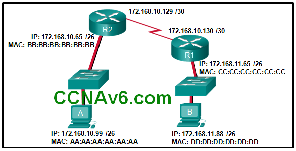
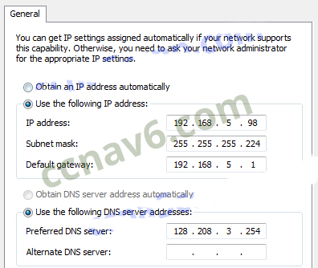
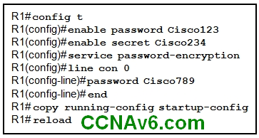
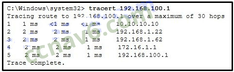
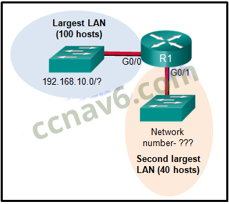
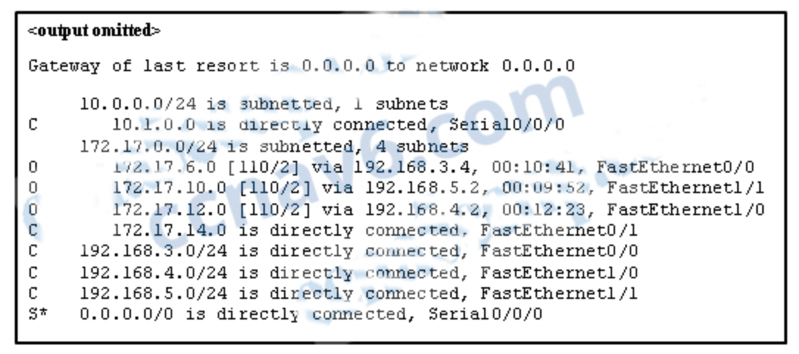
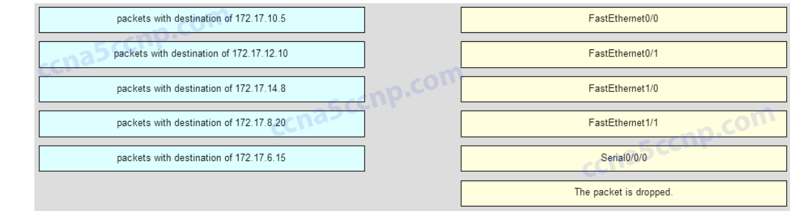
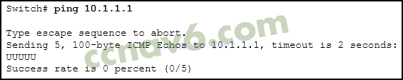
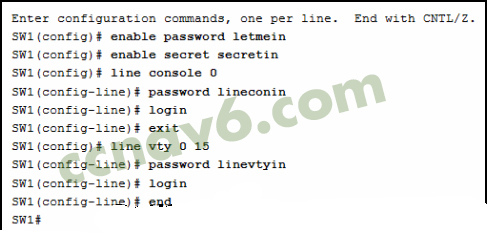
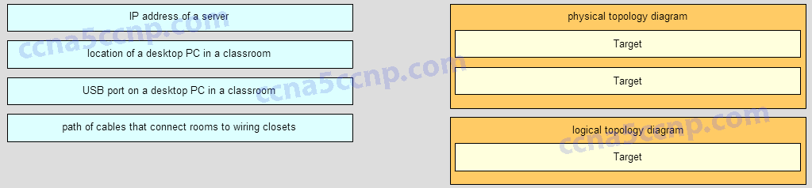

# CCNA Final Exam Questions

1.  **What is a characteristic of a fault tolerant network?**

    -   a network that protects confidential information from unauthorized access
    -   a network that can expand quickly to support new users and applications without impacting the performance of the service delivered to existing users
    -   a network that supports a mechanism for managing congestion and ensuring reliable delivery of content to all users
    -   a network that recovers quickly when a failure occurs and depends on redundancy to limit the impact of a failure

2.  **Three bank employees are using the corporate network. The first employee uses a web browser to view a company web page in order to read some announcements. The second employee accesses the corporate database to perform some financial transactions. The third employee participates in an important live audio conference with other corporate managers in branch offices. If QoS is implemented on this network, what will be the priorities from highest to lowest of the different data types?**

    -   financial transactions, audio conference, web page
    -   audio conference, financial transactions, web page
    -   audio conference, web page, financial transactions
    -   financial transactions, web page, audio conference

3.  **What is a benefit of using cloud computing in networking?**

    -   End users have the freedom to use personal tools to access information and communicate across a business network.
    -   Network capabilities are extended without requiring investment in new infrastructure, personnel, or software.
    -   Technology is integrated into every-day appliances allowing them to interconnect with other devices, making them more ‘smart’ or automated.
    -   Home networking uses existing electrical wiring to connect devices to the network wherever there is an electrical outlet, saving the cost of installing data cables.

4.  **What is the function of the shell in an OS?**

    -   It interacts with the device hardware.
    -   It interfaces between the users and the kernel.
    -   It provides dedicated firewall services.
    -   It provides the intrusion protection services for the device.

5.  **Which connection provides a secure CLI session with encryption to a Cisco switch?**

    -   a console connection
    -   an AUX connection
    -   a Telnet connection
    -   an SSH connection

6.  **A network technician is attempting to configure an interface by entering the following command: SanJose(config)# ip address 192.168.2.1 255.255.255.0. The command is rejected by the device. What is the reason for this?**

    -   The command is being entered from the wrong mode of operation
    -   The command syntax is wrong
    -   The subnet mask information is incorrect
    -   The interface is shutdown and must be enabled before the switch will accept the IP address

7.  **An administrator uses the Ctrl-Shift-6 key combination on a switch after issuing the ping command. What is the purpose of using these keystrokes?**

    -   To restart the ping process
    -   To interrupt the ping process
    -   To exit to a different configuration mode
    -   To allow the user to complete the command

8.  **Refer to the exhibit. A network administrator is configuring access control to switch SW1. If the administrator uses a console connection to connect to the switch, which password is needed to access user EXEC mode?**

      

      -   letmein
      -   secretin
      -   linevtyin
      -   lineconin

9.  **On which switch interface would an administrator configure an IP address so that the switch can be managed remotely?**

    -   FastEthernet0/1
    -   VLAN 1
    -   vty 0
    -   console 0

10.  **What protocol is responsible for controlling the size of segments and the rate at which segments are exchanged between a web client and a web server?**

  *   TCP
  *   IP
  *   HTTP
  *   Ethernet

11.  **What is an advantage to using a protocol that is defined by an open standard?**

     -   A company can monopolize the market
     -   The protocol can only be run on equipment from a specific vendor
     -   An open standard protocol is not controlled or regulated by standards organizations
     -   It encourages competition and promotes choices

12.  **What are two benefits of using a layered network model? (Choose two.)**

     -   It assists in protocol design
     -   It speeds up packet delivery
     -   It prevents designers from creating their own model
     -   It prevents technology in one layer from affecting other layers
     -   It ensures a device at one layer can function at the next higher layer

13.  **Which two OSI model layers have the same functionality as two layers of the TCP/IP model? (Choose two.)**

     -   data link
     -   network
     -   physical
     -   session
     -   transport

14.  **Which name is assigned to the transport layer PDU?**

     -   bits
     -   data
     -   frame
     -   packet
     -   segment

15.  **A network engineer is measuring the transfer of bits across the company backbone for a mission critical database application. The engineer notices that the network throughput appears lower than the bandwidth expected. Which three factors could influence the differences in throughput? (Choose three.)**

     -   the amount of traffic that is currently crossing the network
     -   the sophistication of the encapsulation method applied to the data
     -   the type of traffic that is crossing the network
     -   the latency that is created by the number of network devices that the data is crossing
     -   the bandwidth of the WAN connection to the Internet
     -   the reliability of the gigabit Ethernet infrastructure of the backbone

16.  **A network administrator is troubleshooting connectivity issues on a server. Using a tester, the administrator notices that the signals generated by the server NIC are distorted and not usable. In which layer of the OSI model is the error categorized?**

     -   presentation layer
     -   network layer
     -   physical layer
     -   data link layer

17.  **Which type of UTP cable is used to connect a PC to a switch port?**

     -   console
     -   rollover
     -   crossover
     -   straight-through

18.  **A network administrator is measuring the transfer of bits across the company backbone for a mission critical financial application. The administrator notices that the network throughput appears lower than the bandwidth expected. Which three factors could influence the differences in throughput? (Choose three.)**

     -   the amount of traffic that is currently crossing the network
     -   the sophistication of the encapsulation method applied to the data
     -   the type of traffic that is crossing the network
     -   the latency that is created by the number of network devices that the data is crossing
     -   the bandwidth of the WAN connection to the Internet
     -   the reliability of the gigabit Ethernet infrastructure of the backbone

19.  **What is a characteristic of UTP cabling?**

     -   cancellation
     -   cladding
     -   immunity to electrical hazards
     -   woven copper braid or metallic foil

20.  **What are two characteristics of fiber-optic cable? (Choose two.)**

     -   It is not affected by EMI or RFI
     -   Each pair of cables is wrapped in metallic foil.
     -   It combines the technique of cancellation, shielding, and twisting to protect data.
     -   It typically contains 4 pairs of fiber-optic wires.
     -   It is more expensive than UTP cabling is

21.  **What is a characteristic of the LLC sublayer?**

     -   It provides the logical addressing required that identifies the device.
     -   It provides delimitation of data according to the physical signaling requirements of the medium.
     -   It places information in the frame allowing multiple Layer 3 protocols to use the same network interface and media
     -   It defines software processes that provide services to the physical layer.

22.  **A network team is comparing physical WAN topologies for connecting remote sites to a headquarters building. Which topology provides high availability and connects some, but not all, remote sites?**

     -   mesh
     -   partial mesh
     -   hub and spoke
     -   point-to-point

23.  **What method is used to manage contention-based access on a wireless network?**

     -   CSMA/CD
     -   priority ordering
     -   CSMA/CA
     -   token passing

24.  **What are the three primary functions provided by Layer 2 data encapsulation? (Choose three.)**

     -   error correction through a collision detection method
     -   session control using port numbers
     -   data link layer addressing
     -   placement and removal of frames from the media
     -   detection of errors through CRC calculations
     -   delimiting groups of bits into frames
     -   conversion of bits into data signals

25.  **What will a host on an Ethernet network do if it receives a frame with a destination MAC address that does not match its own MAC address?**

     -   It will discard the frame
     -   It will forward the frame to the next host
     -   It will remove the frame from the media
     -   It will strip off the data-link frame to check the destination IP address

26.  **What are two examples of the cut-through switching method? (Choose two.)**

     -   store-and-forward switching
     -   fast-forward switching
     -   CRC switching
     -   fragment-free switching
     -   QOS switching

27.  **What are two actions performed by a Cisco switch? (Choose two.)**

     -   building a routing table that is based on the first IP address in the frame header
     -   using the source MAC addresses of frames to build and maintain a MAC address table
     -   forwarding frames with unknown destination IP addresses to the default gateway
     -   utilizing the MAC address table to forward frames via the destination MAC address
     -   examining the destination MAC address to add new entries to the MAC address table

28.  **Which frame forwarding method receives the entire frame and performs a CRC check to detect errors before forwarding the frame?**

     -   cut-through switching
     -   store-and-forward switching
     -   fragment-free switching
     -   fast-forward switching

29.  **Refer to the exhibit. If host A sends an IP packet to host B, what will the destination address be in the frame when it leaves host A?**

     ​      

     -   DD:DD:DD:DD:DD:DD
     -   172.168.10.99
     -   CC:CC:CC:CC:CC:CC
     -   172.168.10.65
     -   BB:BB:BB:BB:BB:BB
     -   AA:AA:AA:AA:AA:AA

30.  **What addresses are mapped by ARP?**

     -   destination MAC address to a destination IPv4 address
     -   destination IPv4 address to the source MAC address
     -   destination IPv4 address to the destination host name
     -   destination MAC address to the source IPv4 address

31.  **What information is added during encapsulation at OSI Layer 3?**

     -   source and destination MAC
     -   source and destination application protocol
     -   source and destination port number
     -   source and destination IP address

32.  **What are two services provided by the OSI network layer? (Choose two.)**

     -   performing error detection
     -   routing packets toward the destination
     -   encapsulating PDUs from the transport layer
     -   placement of frames on the media
     -   collision detection

33.  **Refer to the exhibit. The network administrator for a small advertising company has chosen to use the 192.168.5.96/27 network for internal LAN addressing. As shown in the exhibit, a static IP address is assigned to the company web server. However, the web server cannot access the Internet. The administrator verifies that local workstations with IP addresses that are assigned by a DHCP server can access the Internet, and the web server is able to ping local workstations. Which component is incorrectly configured?**

     ​     

     -   subnet mask
     -   DNS address
     -   host IP address
     -   default gateway address

34.  **Why does a Layer 3 device perform the ANDing process on a destination IP address and subnet mask?**

     -   to identify the broadcast address of the destination network
     -   to identify the host address of the destination host
     -   to identify faulty frames
     -   to identify the network address of the destination network

35.  **What are two functions of NVRAM? (Choose two.)**

     -   to store the routing table
     -   to retain contents when power is removed
     -   to store the startup configuration file
     -   to contain the running configuration file
     -   to store the ARP table

36.  **Refer to the exhibit. What will be the result of entering this configuration be the next time a network administrator connects a console cable to the router and no additional commands have been entered?**

     

     -   The administrator will be required to enter Cisco123
     -   The administrator will be required to enter Cisco234
     -   The administrator will be required to enter Cisco789
     -   The administrator will be presented with the R1> prompt

37.  **What is the dotted decimal representation of the IPv4 address 11001011.00000000.01110001.11010011?**

     -   192.0.2.199
     -   198.51.100.201
     -   203.0.113.211
     -   209.165.201.223

38.  **What are three characteristics of multicast transmission? (Choose three.)**

     -   The source address of a multicast transmission is in the range of 224.0.0.0 to 224.0.0.255
     -   A single packet can be sent to a group of hosts
     -   Multicast transmission can be used by routers to exchange routing information
     -   Routers will not forward multicast addresses in the range of 224.0.0.0 to 224.0.0.255
     -   Computers use multicast transmission to request IPv4 addresses.
     -   Multicast messages map lower layer addresses to upper layer addresses.

39.  **What are the three ranges of IP addresses that are reserved for internal private use? (Choose three.)**

     -   10.0.0.0/8
     -   64.100.0.0/14
     -   127.16.0.0/12
     -   172.16.0.0/12
     -   192.31.7.0/24
     -   192.168.0.0/16

40.  **What purpose does NAT64 serve in IPv6?**

     -   It converts IPv6 packets into IPv4 packets
     -   It translates private IPv6 addresses into public IPv6 addresses
     -   It enables companies to use IPv6 unique local addresses in the network
     -   It converts regular IPv6 addresses into 64-bit addresses that can be used on the Internet
     -   It converts the 48-bit MAC address into a 64-bit host address that can be used for automatic host addressing

41.  **What is the most compressed representation of the IPv6 address 2001:0000:0000: abcd:0000:0000:0000:0001?**

     -   `2001:0​:abcd:​:1`
     -   `2001:0:0​:abcd:​:1`
     -   `2001:​:abcd:​:1`
     -   `2001:0000​:abcd:​:1`
     -   `2001:​:abcd:​0:1`

42.  **Which range of link-local addresses can be assigned to an IPv6-enabled interface?**

     -   FEC0::/10
     -   FDEE::/7
     -   FE80::/10
     -   FF00::/8

43.  **Which three addresses are valid public addresses? (Choose three.)**

     -   198.133.219.17
     -   192.168.1.245
     -   10.15.250.5
     -   128.107.12.117
     -   192.15.301.240
     -   64.104.78.227

44.  **Refer to the exhibit. On the basis of the output, which two statements about network connectivity are correct? (Choose two.)**

     ​     

     -   There is connectivity between this device and the device at 192.168.100.1
     -   The connectivity between these two hosts allows for videoconferencing calls
     -   There are 4 hops between this device and the device at 192.168.100.1
     -   The average transmission time between the two hosts is 2 milliseconds.
     -   This host does not have a default gateway configured.

45.  **What type of IPv6 address is FE80::1?**

     -   loopback
     -   link-local
     -   multicast
     -   global unicast

46.  **How many valid host addresses are available on an IPv4 subnet that is configured with a /26 mask?**

     -   254
     -   190
     -   192
     -   62
     -   64

47.  **A site administrator has been told that a particular network at the site must accommodate 126 hosts. Which subnet mask would be used that contains the required number of host bits?**

     -   255.255.255.0
     -   255.255.255.128
     -   255.255.255.224
     -   255.255.255.240

48.  **A network administrator wants to have the same subnet mask for three subnetworks at a small site. The site has the following networks and numbers of devices:**
     **Subnetwork A: IP phones – 10 addresses**
     **Subnetwork B: PCs – 8 addresses**
     **Subnetwork C: Printers – 2 addresses**

     **What single subnet mask would be appropriate to use for the three subnetworks?**

     -   255.255.255.0
     -   255.255.255.240
     -   255.255.255.248
     -   255.255.255.252

49.  **How many hosts are addressable on a network that has a mask of 255.255.255.248?**

     -   2
     -   6
     -   8
     -   14
     -   16
     -   254

50.  **Which subnet would include the address 192.168.1.96 as a usable host address?**

     -   192.168.1.64/26
     -   192.168.1.32/27
     -   192.168.1.32/28
     -   192.168.1.64/29

51.  **What subnet mask is needed if an IPv4 network has 40 devices that need IP addresses and address space is not to be wasted?**

     -   255.255.255.0
     -   255.255.255.128
     -   255.255.255.192
     -   255.255.255.224
     -   255.255.255.240

52.  **What are two characteristics shared by TCP and UDP? (Choose two.)**

     -   default window size
     -   connectionless communication
     -   port numbering
     -   3-way handshake
     -   ability to to carry digitized voice
     -   use of checksum

53.  **Why are port numbers included in the TCP header of a segment?**

     -   to indicate the correct router interface that should be used to forward a segment
     -   to identify which switch ports should receive or forward the segment
     -   to determine which Layer 3 protocol should be used to encapsulate the data
     -   to enable a receiving host to forward the data to the appropriate application
     -   to allow the receiving host to assemble the packet in the proper order

54.  **Refer to the exhibit. Consider the IP address of 192.168.10.0/24 that has been assigned to a high school building. The largest network in this building has 100 devices. If 192.168.10.0 is the network number for the largest network, what would be the network number for the next largest network, which has 40 devices?**

     

     -   192.168.10.0
     -   192.168.10.128
     -   192.168.10.192
     -   192.168.10.224
     -   192.168.10.240

55.  **Which statement is true about variable-length subnet masking?**

     -   Each subnet is the same size
     -   The size of each subnet may be different, depending on requirements
     -   Subnets may only be subnetted one additional time
     -   Bits are returned, rather than borrowed, to create additional subnets

56.  **In what two situations would UDP be the preferred transport protocol over TCP? (Choose two.)**

     -   when applications need to guarantee that a packet arrives intact, in sequence, and unduplicated
     -   when a faster delivery mechanism is needed
     -   when delivery overhead is not an issue
     -   when applications do not need to guarantee delivery of the data
     -   when destination port numbers are dynamic

57.  **What important information is added to the TCP/IP transport layer header to ensure communication and connectivity with a remote network device?**

     -   timing and synchronization
     -   destination and source port numbers
     -   destination and source physical addresses
     -   destination and source logical network addresses

58.  **What is the TCP mechanism used in congestion avoidance?**

     -   three-way handshake
     -   socket pair
     -   two-way handshake
     -   sliding window

59.  **Which scenario describes a function provided by the transport layer?**

     -   A student is using a classroom VoIP phone to call home. The unique identifier burned into the phone is a transport layer address used to contact another network device on the same network.
     -   A student is playing a short web-based movie with sound. The movie and sound are encoded within the transport layer header.
     -   A student has two web browser windows open in order to access two web sites. The transport layer ensures the correct web page is delivered to the correct browser window.
     -   A corporate worker is accessing a web server located on a corporate network. The transport layer formats the screen so the web page appears properly no matter what device is being used to view the web site.

60.  **A user opens three browsers on the same PC to access www.cisco.com to search for certification course information. The Cisco web server sends a datagram as a reply to the request from one of the web browsers. Which information is used by the TCP/IP protocol stack in the PC to identify which of the three web browsers should receive the reply?**

     -   the destination IP address
     -   the destination port number
     -   the source IP address
     -   the source port number

61.  **What are two ways that TCP uses the sequence numbers in a segment? (Choose two.)**

     -   to identify missing segments at the destination
     -   to reassemble the segments at the remote location
     -   to specify the order in which the segments travel from source to destination
     -   to limit the number of segments that can be sent out of an interface at one time
     -   to determine if the packet changed during transit

62.  **Which two tasks are functions of the presentation layer? (Choose two.)**

     -   compression
     -   addressing
     -   encryption
     -   session control
     -   authentication

63.  **Which three statements characterize UDP? (Choose three.)**

     -   UDP provides basic connectionless transport layer functions.
     -   UDP provides connection-oriented, fast transport of data at Layer 3.
     -   UDP relies on application layer protocols for error detection.
     -   UDP is a low overhead protocol that does not provide sequencing or flow control mechanisms.
     -   UDP relies on IP for error detection and recovery.
     -   UDP provides sophisticated flow control mechanisms.

64.  **What is a key characteristic of the peer-to-peer networking model?**

     -   wireless networking
     -   social networking without the Internet
     -   network printing using a print server
     -   resource sharing without a dedicated server

65.  **A technician can ping the IP address of the web server of a remote company but cannot successfully ping the URL address of the same web server. Which software utility can the technician use to diagnose the problem?**

     -   tracert
     -   ipconfig
     -   netstat
     -   nslookup

66.  **Which domain name would be an example of a top-level domain?**

     -   www.cisco.com
     -   cisco.com
     -   .com
     -   root.cisco.com

67.  **A PC obtains its IP address from a DHCP server. If the PC is taken off the network for repair, what happens to the IP address configuration?**

     -   The configuration is permanent and nothing changes.
     -   The address lease is automatically renewed until the PC is returned.
     -   The address is returned to the pool for reuse when the lease expires.
     -   The configuration is held by the server to be reissued when the PC is returned.

68.  **When planning for network growth, where in the network should packet captures take place to assess network traffic?**

     -   on as many different network segments as possible
     -   only at the edge of the network
     -   between hosts and the default gateway
     -   only on the busiest network segment

69.  **A wireless host needs to request an IP address. What protocol would be used to process the request?**

     -   FTP
     -   HTTP
     -   DHCP
     -   ICMP
     -   SNMP

70.  **Which example of malicious code would be classified as a Trojan horse?**

     -   malware that was written to look like a video game
     -   malware that requires manual user intervention to spread between systems
     -   malware that attaches itself to a legitimate program and spreads to other programs when launched
     -   malware that can automatically spread from one system to another by exploiting a vulnerability in the target

71.  **When applied to a router, which command would help mitigate brute-force password attacks against the router?**

     -   exec-timeout 30
     -   service password-encryption
     -   banner motd $Max failed logins = 5$
     -   login block-for 60 attempts 5 within 60

72.  **A network technician suspects that a particular network connection between two Cisco switches is having a duplex mismatch. Which command would the technician use to see the Layer 1 and Layer 2 details of a switch port?**

     -   show mac-address-table
     -   show ip interface brief
     -   show interfaces
     -   show running-config

73.  **Where are Cisco IOS debug output messages sent by default?**

     -   Syslog server
     -   console line
     -   memory buffers
     -   vty lines

74.  **Match the description with the associated IOS mode. (not all options are used.)**

     -   Question
         

75.  **Refer to the exhibit. Match the packets with their destination IP address to the existing interfaces on the router. (Not all targets are used).**
     

     -   Question

76.  **Refer to the exhibit. An administrator is testing connectivity to a remote device with the IP address 10.1.1.1. What does the output of this command indicate?**

           

     -   Connectivity to the remote device was successful.
     -   A router along the path did not have a route to the destination.
     -   A ping packet is being blocked by a security device along the path.
     -   The connection timed out while waiting for a reply from the remote device.

77.  **A user is unable to reach the web site when typing http://www.cisco.com in a web browser, but can reach the same site by typing http://72.163.4.161. What is the issue?**

     -   default gateway
     -   DHCP
     -   TCP/IP protocol stack
     -   DNS

78.  **A company is expanding its business to other countries. All branch offices must remain connected to corporate headquarters at all times. Which network technology is required to support this requirement?**

     -   LAN
     -   MAN
     -   WAN
     -   WLAN

79.  **A home user is looking for an ISP connection that provides high speed digital transmission over regular phone lines. What ISP connection type should be used?**

     -   DSL
     -   dial-up
     -   satellite
     -   cell modem
     -   cable modem

80.  **How does quality of service help a network support a wide range of applications and services?**

     -   by limiting the impact of a network failure
     -   by allowing quick recovery from network failures
     -   by providing mechanisms to manage congested network traffic
     -   by providing the ability for the network to grow to accommodate new users

81.  **What source IP address does a router use by default when the traceroute command is issued?**

     -   the highest configured IP address on the router
     -   the lowest configured IP address on the router
     -   a loopback IP address
     -   the IP address of the outbound interface

82.  **After making configuration changes on a Cisco switch, a network administrator issues a copy running-config startup-config command. What is the result of issuing this command?**

     -   The new configuration will be stored in flash memory.
     -   The new configuration will be loaded if the switch is restarted.
     -   The current IOS file will be replaced with the newly configured file.
     -   The configuration changes will be removed and the original configuration will be restored.

83.  **Refer to the exhibit. A network administrator is configuring access control to switch SW1. If the administrator has already logged into a Telnet session on the switch, which password is needed to access privileged EXEC mode?**

           

     -    letmein
     -    secretin
     -    lineconin
     -    linevtyin

84.  **Match each item to the type of topology diagram on which it is typically identified. (Not all options are used.)**

     *   Question
         

85.  **Which connection provides a secure CLI session with encryption to a Cisco network device?**

     -   a console connection
     -   an AUX connection
     -   a Telnet connection
     -   an SSH connection

86.  **What function does pressing the Tab key have when entering a command in IOS?**

     -   It aborts the current command and returns to configuration mode.
     -   It exits configuration mode and returns to user EXEC mode.
     -   It moves the cursor to the beginning of the next line.
     -   It completes the remainder of a partially typed word in a command.

87.  **What layer is responsible for routing messages through an internetwork in the TCP/IP model?**

     -   internet
     -   transport
     -   network access
     -   session

88.  **Which statement accurately describes a TCP/IP encapsulation process when a PC is sending data to the network?**

     -   Data is sent from the internet layer to the network access layer.
     -   Packets are sent from the network access layer to the transport layer.
     -   Segments are sent from the transport layer to the internet layer.
     -   Frames are sent from the network access layer to the internet layer.

89.  **What unique address is embedded in an Ethernet NIC and used for communication on an Ethernet network?**

     -   host address
     -   IP address
     -   MAC address
     -   network address
     -   k layer

90.  **Which procedure is used to reduce the effect of crosstalk in copper cables?**

     -   requiring proper grounding connections
     -   twisting opposing circuit wire pairs together
     -   wrapping the bundle of wires with metallic shielding
     -   designing a cable infrastructure to avoid crosstalk interference
     -   avoiding sharp bends during installation

91.  **During the encapsulation process, what occurs at the data link layer for a PC connected to an Ethernet network?**

     -   An IP address is added.
     -   The logical address is added.
     -   The physical address is added.
     -   The process port number is added.

92.  **What are two characteristics of Ethernet MAC addresses? (Choose two.)**

     -   They are globally unique.
     -   They are routable on the Internet.
     -   They are expressed as 12 hexadecimal digits.
     -   MAC addresses use a flexible hierarchical structure.
     -   MAC addresses must be unique for both Ethernet and serial interfaces on a device.

93.  **If a device receives an Ethernet frame of 60 bytes, what will it do?**

     -   drop the frame
     -   process the frame as it is
     -   send an error message to the sending device
     -   add random data bytes to make it 64 bytes long and then forward it

94.  **Under which two circumstances will a switch flood a frame out of every port except the port that the frame was received on? (Choose two.)**

     -   The frame has the broadcast address as the destination address.
     -   The destination address is unknown to the switch.
     -   The source address in the frame header is the broadcast address.
     -   The source address in the frame is a multicast address.
     -   The destination address in the frame is a known unicast address.

95.  **Which switching method has the lowest level of latency?**

     -   cut-through
     -   store-and-forward
     -   fragment-free
     -   fast-forward

96.  **Which two commands can be used on a Windows host to display the routing table? (Choose two.)**

     -   netstat -s
     -   route print
     -   show ip route
     -   netstat -r
     -   tracert

97.  **Which two functions are primary functions of a router? (Choose two.)**

     -   packet forwarding
     -   microsegmentation
     -   domain name resolution
     -   path selection
     -   flow control

98.  **What is the binary representation of 0xCA?**

     -   10111010
     -   11010101
     -   11001010
     -   11011010

99.  **At a minimum, which address is required on IPv6-enabled interfaces?**

     -   link-local
     -   unique local
     -   site local
     -   global unicast

100.  **Which service provides dynamic global IPv6 addressing to end devices without using a server that keeps a record of available IPv6 addresses?**

   -   stateful DHCPv6
   -   SLAAC
   -   static IPv6 addressing
   -   stateless DHCPv6

101.  **What is the purpose of the command ping ::1?**

      -   It tests the internal configuration of an IPv6 host.
      -   It tests the broadcast capability of all hosts on the subnet.
      -   It tests the multicast connectivity to all hosts on the subnet.
      -   It tests the reachability of the default gateway for the network.

102.  **How many usable IP addresses are available on the 192.168.1.0/27 network?**

      -   256
      -   254
      -   62
      -   30
      -   16
      -   32

103.  **What is the process of dividing a data stream into smaller pieces before transmission?**

      -   segmentation
      -   encapsulation
      -   encoding
      -   flow control

104.  **When IPv4 addressing is manually configured on a web server, which property of the IPv4 configuration identifies the network and host portion for an IPv4 address?**

      -   DNS server address
      -   subnet mask
      -   default gateway
      -   DHCP server address

105.  **Which two roles can a computer assume in a peer-to-peer network where a file is being shared between two computers? (Choose two.)**

      -   client
      -   master
      -   server
      -   slave
      -   transient

106.  **Which two protocols operate at the highest layer of the TCP/IP protocol stack? (Choose two.)**

      -   DNS
      -   Ethernet
      -   IP
      -   POP
      -   TCP
      -   UDP

107.  **What is one difference between the client-server and peer-to-peer network models?**

      -   Only in the client-server model can file transfers occur.
      -   Every device in a peer-to-peer network can function as a client or a server.
      -   A peer-to-peer network transfers data faster than a transfer using a client-server network.
      -   A data transfer that uses a device serving in a client role requires that a dedicated server be present.

108.  **What is the function of the HTTP GET message?**

      -   to request an HTML page from a web server
      -   to send error information from a web server to a web client
      -   to upload content to a web server from a web client
      -   to retrieve client email from an email server using TCP port 110

109.  **Which networking model is being used when an author uploads one chapter document to a file server of a book publisher?**

      -   peer-to-peer
      -   master-slave
      -   client/server
      -   point-to-point

110.  **What network service resolves the URL entered on a PC to the IP address of the destination server?**

      -   DNS
      -   DHCP
      -   FTP
      -   SNMP

111.  **A network engineer is analyzing reports from a recently performed network baseline. Which situation would depict a possible latency issue?**

      -   a change in the bandwidth according to the show interfaces output
      -   a next-hop timeout from a traceroute
      -   an increase in host-to-host ping response times
      -   a change in the amount of RAM according to the show version output

112.  **Which firewall feature is used to ensure that packets coming into a network are legitimate responses to requests initiated from internal hosts?**

      -   stateful packet inspection
      -   URL filtering
      -   application filtering
      -   packet filtering

113.  **What is one indication that a Windows computer did not receive an IPv4 address from a DHCP server?**

      -   The computer cannot ping 127.0.0.1.
      -   Windows displays a DHCP timeout message.
      -   The computer receives an IP address that starts with 169.254
      -   The computer cannot ping other devices on the same network with IP addresses in the 169.254.0.0/16 range.

114.  **Which command can an administrator issue on a Cisco router to send debug messages to the vty lines?**

      -   terminal monitor
      -   logging console
      -   logging buffered
      -   logging synchronous

115.  **Fill in the blank.**
      **During data communications, a host may need to send a single message to a specific group of destination hosts simultaneously. This message is in the form of a ___________________ message.**

116.  **A medium-sized business is researching available options for connecting to the Internet. The company is looking for a high speed option with dedicated, symmetric access. Which connection type should the company choose?**

      -   DSL
      -   dialup
      -   satellite
      -   leased line
      -   cable modem

117.  **What is the purpose of having a converged network?**

      -   to provide high speed connectivity to all end devices
      -   to make sure that all types of data packets will be treated equally
      -   to achieve fault tolerance and high availability of data network infrastructure devices
      -   to reduce the cost of deploying and maintaining the communication infrastructure

118.  **What characteristic of a network enables it to quickly grow to support new users and applications without impacting the performance of the service being delivered to existing users?**

      -   reliability
      -   scalability
      -   quality of service
      -   accessibility

119.  **After several configuration changes are made to a router, the copy running-configuration startup-configuration command is issued. Where will the changes be stored?**

      -   flash
      -   ROM
      -   NVRAM
      -   RAM
      -   the configuration register
      -   a TFTP server

120.  **Refer to the exhibit. From global configuration mode, an administrator is attempting to create a message-of-the-day banner by using the command banner motd V Authorized access only! Violators will be prosecuted! V When users log in using Telnet, the banner does not appear correctly. What is the problem?**

      

      -   The banner message is too long.
      -   The delimiting character appears in the banner message.
      -   The symbol “!” signals the end of a banner message.
      -   Message-of-the-day banners will only appear when a user logs in through the console port.

121.  **What are three characteristics of an SVI? (Choose three.)**

      -   It is designed as a security protocol to protect switch ports.
      -   It is not associated with any physical interface on a switch.
      -   It is a special interface that allows connectivity by different types of media.
      -   It is required to allow connectivity by any device at any location.
      -   It provides a means to remotely manage a switch.
      -   It is associated with VLAN1 by default.

122.  **A technician configures a switch with these commands:**

      **SwitchA(config)# interface vlan 1** 

      **SwitchA(config-if)# ip address 192.168.1.1 255.255.255.0** 

      **SwitchA(config-if)# no shutdown**

      **What is the technician configuring?**

      -   Telnet access
      -   SVI
      -   password encryption
      -   physical switchport access

123.  **In computer communication, what is the purpose of message encoding?**

      -   to convert information to the appropriate form for transmission
      -   to interpret information
      -   to break large messages into smaller frames
      -   to negotiate correct timing for successful communication

124.  **What is a characteristic of multicast messages?**

      -   They are sent to a select group of hosts
      -   They must be acknowledged.
      -   They are sent to a single destination.
      -   They are sent to all hosts on a network.

125.  **A large corporation has modified its network to allow users to access network resources from their personal laptops and smart phones. Which networking trend does this describe?**

      -   bring your own device
      -   video conferencing
      -   online collaboration
      -   cloud computing

126.  **True or False.**
      **A dedicated server is not needed when implementing a peer-to-peer network.**

      -   true
      -   false

127.  **Which term refers to a network that provides secure access to the corporate offices by suppliers, customers and collaborators?**

      -   Internet
      -   intranet
      -   extranet
      -   extendednet

128.  **What subnet mask is required to support 512 subnets on networks 172.28.0.0/16?**

      -   255.255.240.0
      -   255.255.255.224
      -   255.255.255.240
      -   255.255.255.128
      -   255.255.252.0

129.  **A DHCP server is used to assign IP addresses dynamically to the hosts on a network. The address pool is configured with 10.29.244.0/25. There are 19 printers on this network that need to use reserve static IP addresses from the pool. How many IP addresses in the pool are left to be assign to other hosts?**

      -   210
      -   60
      -   109
      -   107
      -   146
