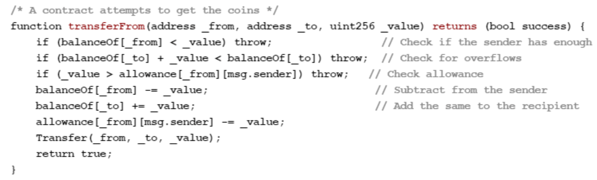

# Blockchain

Normalerweise sind bei Online-Transaktionen Trusted Third Parties involviert. Diese verifizieren und geben dann die Transaktionen frei oder nicht.

Es gibt drei Systeme dabei:

* **Zentrales System**: absolute Entscheidungshoheit (hohe Machtkonzentration)
* **Dezentrales System**: Entscheidungshoheit/Kontrolle auf mehrere Hubs verteilt
* **Verteiltes System**:  alle Peers gleichwertig (hohe Selbstverwaltung)

Wie könnte eine mögliche Lösungen aussehen in der die Vertrauenswürdigkeit ohne eine Trusted Third Party besteht?

* Option 1: Mario und Alex vertrauen sich blind
* Option 2: Mario und Alex setzen einen schriftlichen Vertrag auf
* Option 3: Mario und Alex ziehen eine neutrale Instanz hinzu
* Option 4: Smart Contract auf einem Distributed Ledger

Blockchain basiert nun auf **Smart Contracts** (automatisierte Verträge). Sie sind Computerprotokolle, welche die Abwicklung von Verträgen technisch unterstützen. Smart Contracts bilden die Logik vertraglicher Regelungen technisch ab. Smart Contracts sind teilweise oder vollständig selbst ausführbar oder selbst durchsetzbar oder beides.

Um Transfer auszuführen brauch man Währung in einer Wallet.

**Wallet**: verwaltet Bitcoin Adressen.

> Kontostand basiert auf Transaktionen und nicht auf Anzahl Geld auf Konto.
> Es zeigt Anzahl **received** (input) und Anzahl **sent** (output) Bitcoins und Summe daraus.

Um ungewünschten Zugriff zu verhindern wird ein **Private**- und **Public**-**Key** für das Wallet verwendet. 

> Der erste Schritt bei der Erstellung einer neuen Bitcoin Adresse besteht in der Berechnung eines Private Keys. Aus dem Private Key wird danach der Public Key abgeleitet. Aus dem Public Key wiederum wird mittels hashing die Bitcoin Adresse berechnet.

> Aus einer Bitcoin Adresse können weder Public- noch Private Key abgeleitet werden.

> Die Person die den Vertrag erstellt hat, hat read und write Rechte und mit dem Public Key hat man nur read Rechte. (Nach Abschluss kann man den Vertrag ändern, macht aber keinen Sinn, da er schon auf mehreren Peers propagiert wurde $\to$ **Distributed Ledger**)

**Distributed Ledger**: Verteilte Datenbank die Transaktionen speichert (nicht Kontostand). Ein distributed Ledger ist ein Peer-to-Peer Netzwerk mit zahlreichen Nodes, welche jeweils die Rolle einer Datenbank einnehmen. (Verteilte Datenbank). Je mehr Nodes desto höher die Sicherheit des distributed Ledgers

**Full Node**: Prüfen Gültigkeit von neuen Blöcken & Transaktionen gemäss **Consensus Rules**. Gibt aber immer weniger Full Nodes. Scheisse wär wenn es immer weniger Full Nodes gäbe, könnten sich Full Nodes zusammenschliessen. Sobald die Mehrheit zusammengeschlossen ist, dann könnten diese die Consensus Rules manipulieren. (Keine Belohnung und darum kleine Motivation Full Node zu haben)

**Minor Nodes**:

* Full Nodes mit zusätzlicher Aufgabe die Transaktionen in Blöcke zu schreiben und somit neue Blöcke generiert
* Als Belohnung erhalten sie vordefinierte Anzahl Bitcoins
* absichtlich ressourcenintensiv

**Proof of Work**:

* Consensus Algorithmus
* Stellt sicher, dass der neueste Block in Blockchain validiert ist
* Keine Abspaltung von Chain

**Nounce**: zufällig generierter Wert, welcher in Kombination mit dem vorangehenden Hash und den Transaktionen im Block einen neuen Hash produziert.