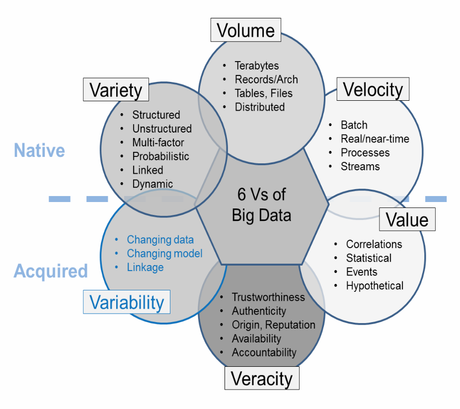

# Big Data Management

Die Anzahl digitale Daten wird immer grösser. Die Frage ist, wie man damit umgehen soll.

> Es gibt ein data intelligence gap, da wir immer mehr Daten haben (exponentiell), aber unsere Lernkurve linear ist. **Lösung**: Daten intelligenter sortieren.

Was ist Big Data (Stand 2014):

> Stand 2015: “Big Data consists of extensive datasets primarily in the characteristics of volume, variety, velocity, and/or variability that require a scalable architecture for efficient storage, manipulation, and analysis.” $\to$ müssen also nicht alle V's gleichzeitig sein

> Was Big Data nicht ist: $big data \neq data science$ und $big data \neq Hadoop$. $big data \subset data$^* (^* conditions apply)

## Technology

**Hadoop**: Distributed File System