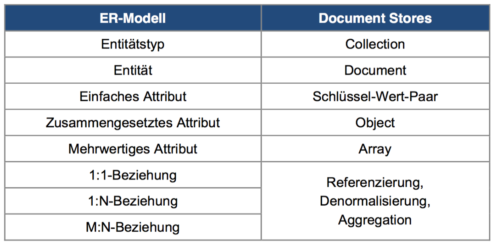

# Dokument-Datenbanken

## Datenmanagement

**Dokument Stores**:

* verwalten einzelne Datensätze in "Dokumenten" (JSON)
* Hohe Flexibilität der Speicherung unterschiedlicher Strukturen
* Alternative zu relationalen Datenbanken in Anwendungsfällen mit heterogenen Datensätzen
* MongoDB/CouchDB

**Dokument**:

* Strukturierte Sammlung mehrerer Schlüssel-Wert-Paare (JSON/YAML/XML)

> JSON $\neq$ Markupsprache

**Datenbankmodell**:

TODO

## Datenmodellierung

Abbildung von Entitätsmengen (EM):

* EM können durch eine Collection abgebildet werden
* Innerhalb Collection werden einzelne Realweltobjekte durch ein Dokument repräsentiert
* Eigenschaften des Objekts werden als Schlüssel-Wert-Paare im zugehörigen Dokument gespeichert.
* in einer Collection verwaltete Dokumente können sich in ihrer Struktur voneinander unterscheiden
* => Spezialisierungen und Generalisierungen können in der gleichen Collection gespeichert werden

**Beziehungsmengen**:

* Keine Auflösung von Fremdschlüsselbeziehung
* Keine Sicherstellung der Integrität von Referenzen
*  Dokument-DBs stellen die komplexen Datentypen Array und Object bereit und eröffnen dadurch drei Mog̈ lichkeiten in der Abbildung von Beziehungen:


	1. **Referenzierung** 
	Speicherung der ID‘s der referenzierten Datensätze 
	2. **Denormalisierung** 
	Speicherung einer Kopie des referenzierten Datensatzes
	3. **Aggregation** 
	Speicherung des referenzierten Datensatzes als Unterteile
	
> Ich als Entwickler entscheide, ob ich Referenzierung, Denormalisierung oder Aggregation verwende
	

> Ungelöstes Problem: Wie modelliert man MongoDB?  
> Viele zeichnen einfach Beispiel-JSON auf.

## Datenbanksprache

Dokument-Datenbanken sind relational unvollständig

**Anfrageverarbeitung MongoDB**:

`db.collectionName.find({<Selektion>, {<Projektion>})`

Collection: `collectionName` 
Operation: `find()`  
Parameter: `<Selektion>`, `<Projektion>`

// TODO

## Konsistenzsicherung

Bei Dokumentdatenbanken:

* kein festes Datenschema
* Struktur gespeicherter Dokument nicht zuvor definiert
* einzelne Dokumente unterscheiden sich innerhalb einer Collection nicht vollständig voneinander
* Definition/Prüfung der Datenintegrität auf Applikationsebene
* Ausnahme: CouchDB (optional Integrität durch Träger, die bei jeder Schreiboperation auf entsprechenden Dokument ausgeführt wird)

**Transaktionsmanagement**:

MongoDB unterstützt keine Transaktionen!

• Operationen müssen einzeln ausgeführt werden
• Operation umfasst Änderungen auf ein Dokument, werden diese
Änderungen atomar durchgeführt
• Operation umfasst Änderungen auf mehreren Dokumenten, werden diese unabhängig voneinander ausgeführt
• transaktionale Atomarität muss bei Document Stores auf Anwendungsebene sichergestellt werden
• Aggregation fasst zusammenhängende Sachverhalten zu einem Dokument zusammen
• Dauerhaftigkeit wird in MongoDB mittels einer Log-Datei (WAL- Prinzip) sichergestellt.

## Systemarchitektur

// TODO Indizes zur Anfrageoptimierung

**Replica Sets**: 1..n Knoten, welche zu verarbeitende Dokumente speichern. (Prio: hohe Verfügbarkeit)

**Router**: "Mongos", bilden Schnittstelle für client-Anfragen.

**Config Server**: // TODO

// TODO

