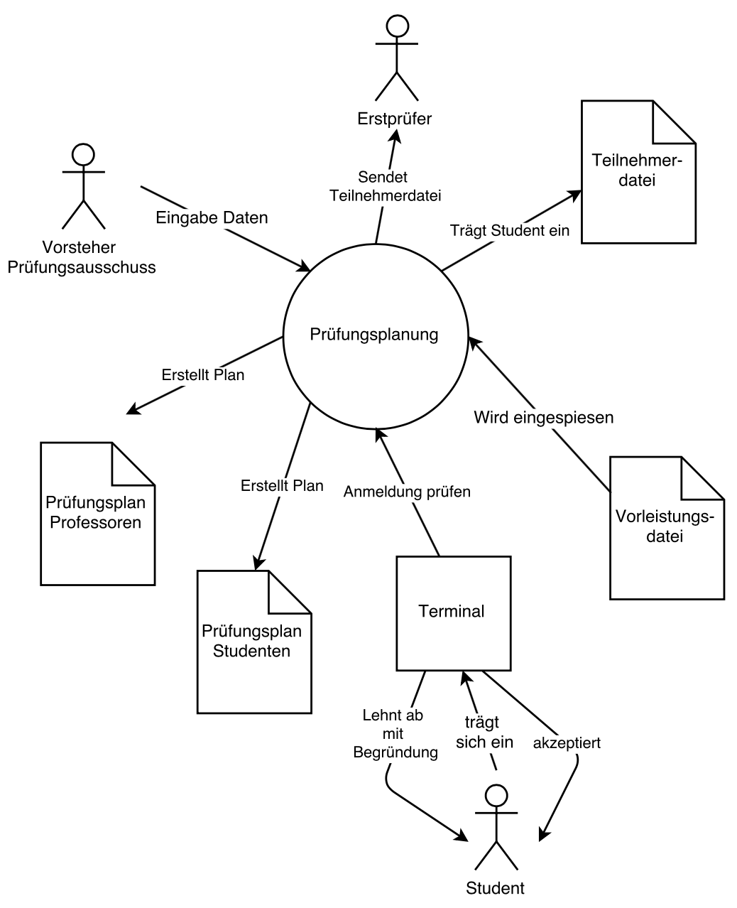

# Aufgaben PMRE

## Setting, Stakeholder, Scope

### 01. Aufgeführte Anforderungen einordnen und Unterschiede herausarbeiten
---

**Anforderung 1:** Das System soll alle Bibliotheksobjekte verwalten. Bibliotheksobjekte sind Bücher, Journale, Zeitungen, Zeitschriften, Videokassetten, Audiokassetten und DVDs.

* Systemanforderung $\to$ Informationsstruktur $\to$ DB
* Handelt sich um eine Bibliotheksverwaltung

	
**Anforderung 2:** Ein Benutzer soll Bibliotheksobjekte über Titel, Autor oder ISBN suchen können.

* Funktionsanforderung
* Könnte mit Use Case modelliert werden
* Funktion, die für Benutzer nutzen hat

**Anforderung 3:** Das System soll auf der Basis WWW-Browsertechnologie entwickelt werden.

* Systemanforderung
* Bezieht sich auf Performance

**Anforderung 4:** Die Benutzung des Systems muss öffentlichen Benutzern in maximal 5 Minuten erklärt werden können.

* Qualitätsanforderung
* Bezieht sich auf Usability

### 02. Ziele analysieren und strukturieren
---

**Ziel:** Das neue Bibliothekssystem soll das Aussondern der Leihobjekte, die seit drei Jahren nicht mehr entliehen wurden, erleichtern.

**Anforderungsquelle:** Bibliothekar, der die Leihobjekte aussondert (Vertreter: X. Y.)

**Auswirkungen auf den Stakeholder:** Katalogisierung und Inventarisierung werden beschleunigt.

**Einschränkungen:** Der zuständige Bibliothekar möchte weiterhin mit dem Karteisystem arbeiten.

**Sonstiges:** ...

### 03. Welche Fragen sind relevant bei der Analyse von Stakeholdern?
---

* Welche Individuen und Gruppen haben am Projekt und am System welche Interessen?
* Welche unterschiedlichen Wertvorstellungen sind vorhanden?
* Wie wird das Vorhaben bewertet?
* Wer hat welche Interessen und Einflüsse auf das
Vorhaben?
* Welches sind mögliche Gewinner oder Verlierer?
* Welche Benutzercharakteristiken müssen beachtet werden?

### 04. Was sind Beispiele von Stakeholder?
---

* Management
* Anwender des Systems
* Wartungs- und Servicepersonal des Systems
* Schulungs- und Trainingspersonal
* Käufer des Systems
* Marketing- und Vertriebsabteilung
* Entwickler
* Projekt- und Produktgegner
* Produktbeseitiger
* Sicherheitsbeauftragte
* Betriebsrat
* Personen aus anderen Kulturkreisen
* Gesetzgeber
* Standardisierungsgremien
* Meinungsführer und öffentliche Meinung
* Prüfer und Auditoren
* Technische Experten
* Produzenten des Produkts
* Produktdesigner
* Experten für Prozessoptimierung und Arbeitsergonomie
* Experten für das Systemumfeld
* Produktlinienverantwortliche Personen
* F&E-verantwortliche Personen
* Controllingabteilung

### 05. Notation der Stakeholderklassen in einem Projekt
---

* Name
* Rolle (Kneipen-Management)
* Beschreibung (Nennt Produkt/Projektziele)
* Konkrete Vertreter (Herr Müller, tel:, etc...)
* Verfügbarkeit (5% verfügbar, Urlaub von...bis...)
* Wissensgebiet/-umfang (Kennt alle Produkte)
* Begründung (Entscheidung über Realisierung, Geldgeber)
* Relevanz
* Ziele und Interessen

### 06. Stakeholderanalyse Intranet HSLU
---

**Vision**  
Das Intranet wird zum zentralen Arbeits- und Informationsinstrument für alle Mitarbeitenden der Hochschule Luzern. Es vereinfacht die Systemlandschaft der Hochschule Luzern und gewährleistet einen Zugang zu wichtigen Informationen. Das Intranet vereinfacht zudem die Zusammenarbeit. Dadurch bleibt den Mitarbeitenden im Arbeitsalltag mehr Zeit für das Wesentliche.
Welche Anspruchsgruppen sind für dieses Projekt relevant?

**Lösung**

* Benutzer/User/Anwender
	* Studenten
	* Admin (IT, Informationsarchitektur)
	* Dozenten
	* Schulleitung

Danach würde man die Stakeholder in die Stakeholderklassen einordnen

### 07. Erstelle ein Kontextdiagramm
---

**Ausgangslage**  
Anwendung zur Unterstützung der Prüfungsanmeldungen für Studenten. Dazu sollen zur Mitte des Vorsemesters die für das nächste Semester geplanten Prüfungen in das System übernommen werden. Diese Eingaben (incl. Raum der Prüfung, Länge der Prüfungsdauer, Prüfungsdatum, etc.) werden vom Vorsteher des Prüfungsausschusses durchgeführt. Wenn alle Prüfungen erfasst worden sind, erzeugt das System zwei Prüfungspläne:
 
 * Der Prüfungsplan für die Professoren beinhaltet die Aufsichtsperson der Prüfung und den jeweili- gen Erst- und Zweitprüfer. Er wird allen Professoren zugestellt.
 * Den Prüfungsplan für die Studenten ohne diese Informationen. Dieser Prüfungsplan wird den Stu- denten zugestellt.

Studenten können sich sodann an speziellen Terminals für ihre Prüfungen anmelden. Das System überprüft, ob es die Prüfung überhaupt gibt und ob die Studenten für die Prüfung zugelassen sind. Zur Überprüfung der Vorleistung wird eine bereits existierende Vorleistungsdatei genutzt. Ist der Student für die Prüfung zugelassen, erhält er eine Bestätigung und wird in die Teilnehmerdatei für die Prüfung übernommen. Ansonsten erhält er eine Ablehnung mit Begründung. Nach Ablauf des Anmeldungszeitraums erhalten die jeweiligen Erstprüfer eine Liste mit den für ihre Prüfung zuge- lassenen Studenten.

**Lösung**  
Eine mögliche Lösung. Im Unterricht wurde eine andere Notation verwendet und das Hauptsystem wurde als Prüfungsverwaltung definiert.

Man soll sich immer auch noch fragen, ob ein Dokument zum eigenen System gehört oder von einem anderen System verwaltet wird.

### 07. Was sind mögliche Ziele der Geschäftsführung?
---

* Kosten senken
* Marktanteile steigern
* Kunden binden
* Unabhängigkeit von einzelnen Beratern
* Kein zusätzliches Personal
* Kein Outsourcing des Vertriebs
* schnelle Abwicklung des Projekts
* Einhaltung des Budgets
* Zentralisation vermögender Privatkunden

### 08. Was sind mögliche Ziele der Geschäftsstellenleiter?
---

* Mehr Personal
* Qualifizierte Mitarbeiter
* Schnell Abwicklung
* Transparente Lösung
* Gute Kundenkenntnisse beim Beraten
* Chancengleichheit der Berater
* Betroffene beteiligen

### 09. Wo befinden sich Zielkonflikte zwischen Geschäftsführung & Geschäftsstellenleiter?
---

* z.B. Mehr Personal
