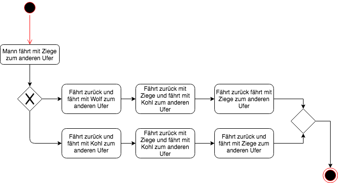

# Übung CRUD-Matrix von Klassendiagramm

### Ausgangslage

### Musterlösung
| Use-Cases $\downarrow$ / Entity Klassen $\to$ | Kunde | Leihobjekt | Reservierung |
| --- | --- | --- | --- |
| Leihobjekt reservieren | R | R | C(RUD) |
| Leihobjekt verlängern | R | R | C(RUD) |

# Übung Modellierung

### Ausgangslage
Ein Mann steht mit einem Wolf, einer Ziege und einem Kohlkopf am linken Ufer eines Flusses, den er überqueren will. Er hat ein Boot, das gerade gross genug ist, ihn und ein weiteres Objekt zu transportieren, sodass er immer nur eines der drei mit sich hinübernehmen kann. Falls der Mann allerdings den Wolf mit der Ziege oder die Ziege mit dem Kohlkopf unbewacht an einem Ufer zurücklässt, wird einer gefressen werden.  

Ist es möglich den Fluss zu überqueren, ohne dass die Ziege oder der Kohlkopf gefressen wird?

### 1. Geeignetes Modell für die Beantwortung obiger Fragestellung

#### Entities

* Mann
* Wolf
* Ziege
* Kohlkopf
* Boot
* Objekt

#### Mögliche Diagramme

* Use-Case Diagramm
* Aktivitätsdiagramm
* Klassendiagramm
* Zustandsdiagramm

#### Meine Wahl Aktivitätsdiagramm

### 2. Begründung der Wahl dieses Modells

