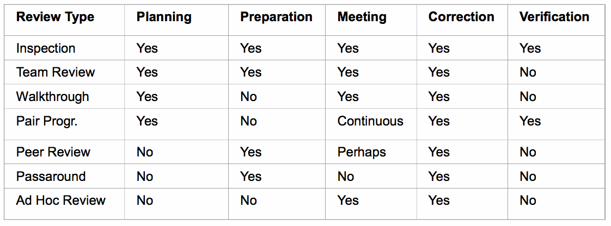

# Prüfen von Anforderungen

## Warum Anforderungen überprüfen?

* Risiko
	* Juristisch (Anforderungsdokumente)
	* Fehlerfortpflanzung (in Code, Architektur, Tests)
* Ziel
	* Früh in Entwicklung erkennen,(Nachbearbeitungsaufwand $\downarrow$, Kosten $\downarrow$)
* Anforderungsfreigabe
	* Anhand Prüf- und Abnahmekriterien entscheiden (vor Entwicklung)

## 3 Hauptziele (IDA)

* **Inhalt**: alle Anforderungen ermittelt
* **Dokumentation**: gemäss Dokumentations- und Spezifikationsvorschriften
* **Abgestimmtheit**: Zustimmung Stakeholder (und Konflikte aufgelöst)

### Prüfkriterien Inhalt

* Vollständigkeit
* Verfolgbarkeit
* Korrektheit / Adäquatheit
* Konsistenz
* Keine vorzeitigen Entwurfsentscheidungen
* Überprüfbarkeit
* Notwendigkeit

### Prüfkriterien Dokumentation

* Konformität Format / Struktur
* Verständlichkeit
* Eindeutigkeit
* Konformität Regeln

### Prüfkriterien Abgestimmtheit

> Meinungen über bereits abgestimmte Anforderungen können ändern. Im Rahmen der Prüfung können Änderungswünsche geäussert werden.

* Abstimmung
* Abstimmung nach Änderungen
* Konflikte aufgelöst

## Prinzipien Anforderungsprüfung

> Verbessert Qualität der Überprüfungsergebnisse

* **Prinzip 1**: Beteilung der richtigen Stakeholder
* **Prinzip 2**: Trennung Fehlersuche / Fehlerkorrektur 
* **Prinzip 3**: Prüfung aus unterschiedlichen Sichten
* **Prinzip 4**: Geeigneter Wechsel der Dokumentationsform
* **Prinzip 5**: Konstruktion von Entwicklungsartefakten
* **Prinzip 6**: Wiederholte Prüfung

---
 
## Reviews

* **Reviews**: interpersonal examinations of an artifact $\to$ Product Quality
* **Audit**: impersonal verification of tangible evidence of a process $\to$ Process Quality
* **Acceptance Tests**: black-box testing performed on system prior to transfer of ownership $\to$ Validation

## Reviews nach Objekten

* **Management Reviews**: Review Projektmanagement-Plan
* **Technical Reviews**: Review Systemspezifikation

## Meilensteine

* **Meilenstein**: 
	* geplanter Punkt im Projektablauf
	* an dem vorher festgelegte Ergebnisse vorliegen
	* die es erlauben den Projektfortschritt zu messen

Meilenstein erreicht wenn:

* geforderte Artefakte vorliegen
* Überprüfung erfolgreich

## Review Typen

* Inspection
* Team Review
* Walkthrough
* Pair Programming
* Peer Deskcheck
* Passaround
* Ad Hoc Review

## Reviews im Projekt-Lebenszyklus

* Das altbekannte V-Modell

Klassische Arten von Reviews:

* Feasibility Review
* Requirements Review
* Prelim. Design Review
* Critical Design Review
* Source Code Review
* Prod. Release Reviews

---
 
## Review Dauer und Zeitpunkt

* Sitzungen 1 - 2 h
* Ein Objekt / Artefakt pro Sitzung überprüfen
* Bevor Objekte / Artefakte im Projektzyklus vorliegen sollten
* besser Anforderungen & Konzepte reviewen statt Detail-Design & Code

## Review Psychologie

* Autor muss sich mit der Idee der Review wohlfühlen
* Als wäre es seine Idee zu reviewen
* Hängt von persönlicher Dynamik ab
* flexibal wer wessen Arbeit reviewed
* nicht wertend, sondern gemeinsam über Werk sprechen
* Fehler nicht an Glocke hängen, sondern lokal lösen

## Vorgehen und Stil

* Objekte vor Review verteilen
* Alle sind vorbereitet
* Kommentare zu Objekte notieren
* Fehler / Probleme im Reviewprotokoll festhalten
* Diskussion abbrechen, nachdem Fehler entdeckt wurde
* Reviews fördern Lernkultur im Betrieb

## Checkliste zur Vorbereitung

1. Reviews im Projektplan vorsehen
2. Review-Ergebnisse systematisch erfassen
3. Teilnehmern Rollen zuordnen
4. Sind alle vorbereitet?

---
 

## Anforderungsüberprüfung in SODA

### Drei Scrum Institutionen bei Überprüfung

* Backlog-Grooming
* Retrospektive
* Sprint-Abnahme

### Generell

* nur wichtigste Anforderungen grob im Produktbacklog
* erst bei Sprintplanung präzis
* Änderungen erlaubt
* Priorisierung
* Verständlichkeit / Abhängigkeit vor Backlog-Grooming überprüfen
* Ergänzungen im Rahmen der Sprint-Abhnahme kontinuierlich abhandeln
* Qualität in Retrospektive hinterfragen und verbessern
* agile Vorgehen hilft frühzeitiges Erkennen von Fehlern