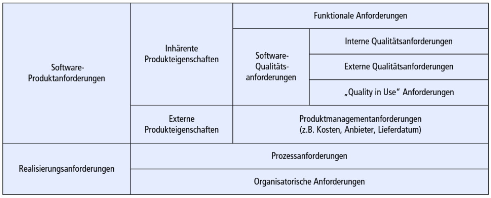
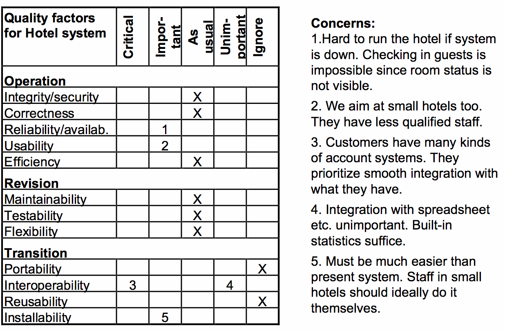

# Qualitätskriterien im RE

## Begriffe

* **Validierung**: Nachweis der Zweckmässigkeit von Anforderungen (Entwickle ich das richtige System)
* **Verifikation**: Nachweis der Korrektheit von Software / Spezifikation (Entwickle ich das System richtig)
* **Mangel**: Eine Anforderung beschreibt gefordertes Systemverhalten nicht (fehlende Info)
* **Fehler**: Eine Anforderung beschreibt gefordertes Systemverhalten falsch (Widerspruch, inkonsistente Info)
* **Konstruktive Qualitätssicherung**: Einsatz von Techniken / Hilfsmittel, um Fehler / Mängel zu vermeiden (z.B. Glossar, Checkliste, Templates)
* **Analytische Qualitätssicherung**: Einsatz von Techniken / Hilfsmittel, um Fehler / Mängel aufzudecken / zu beheben (im Nachhinein Mittel überprüfen z.b. aufgrund des Review-Protokols)

## Grundsätze Qualitätsmanagement RE

* zu erreichende Qualitätsziele früh festlegen
* konstruktive Massnahmen zur Qualitätssicherung früh einführen
* Analytische Massnahme zur Anforderungsprüfung sobald diese stabil sind

## Anforderungsarten

* Ziele beschreiben Zustände
* Funktionen beschreiben Fähigkeiten (Verb)
* Qualitäten beschreiben Eigenschaften (Attribute)
* Randbedingungen schränken den Lösungsraum

## Klassifizierung von Anforderungen

Requirement:

* (Projektrequirement)
* Systemrequirement
	* Functional requirement
	* Attribute
		* Performancerequirement
		* Specific quality requirement
	* Constraint
* (Processrequirement)

## Vorgehen beim Klassifizieren

* funktionale Anforderung
* Leistungsanforderung
* besondere Qualität
* Randbedingung

## Anforderungstypen

* Qualitätsmerkmale in zwei Modelle organisisert:
	* Quality in Use Model
	* Product Quality Model
* Grundlage Ableitung von Qualitätsanforderungen
* Metriken als Nachweis, dass System geforderte Eigenschaft erfüllt

## Quality in Use

* Effectiveness
* Efficiency
* Satisfaction
* Freedon from risk
* Context coverage

## Product In Use

* Functional Suitability
* Performance Efficiency
* Compatability
* Usability
* Reliability
* Security
* Maintainability
* Portability

## Abnahmekriterien

* **Metrik**: Verfahren mit Kennzahlen zur Messung einer Eigenschaft
* **Akzeptanzkriterium**: Angabe Grenzwerte zur Erfüllung einer Eigenschaft
* **Operationalisierung**: Angabe Testszenarien zur sinnvollen Prüfung der Erfüllung einer Eigenschaft

## Quality Grid

