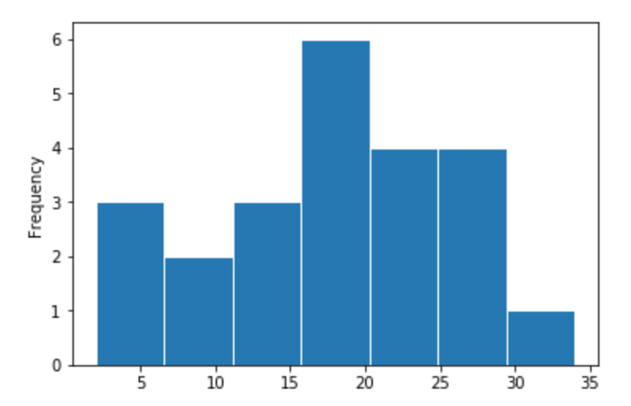
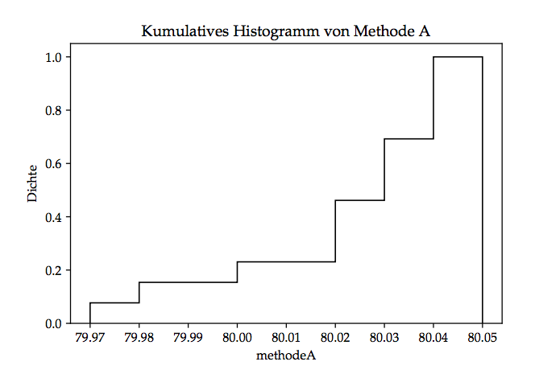

# Deskriptive Statistik (1D)

* Ein Messwert wird beobachtet

## Definition

Quantitative Daten

* zusammenfassen, organisieren
* graphisch darstellen
* um interpretieren und analysieren zu können

Wichtig:

* nicht blind Modell anpassen
* nicht blind statistisches Verfahren anwenden
* zuerst mit Hilfe von graphischen Mitteln und Kennzahlen darstellen

## Nachkommastellen / Signifikante Stellen

### Definition

* **Nachkommastellen**: Ziffern rechts des Kommas (Dezimal-Darstellung)
* **Signifikante Stellen**: erste von Null verschiedene Stelle bis zur Rundungsstelle

### Regeln

1. Das Ergebnis einer **Addition / Subtraktion** bekommt genauso viele Nachkommastellen wie die Zahl mit den wenigsten Nachkommastellen.
2. Das Ergebnis einer **Multiplikation / Division** bekommt genauso viele signifikante Stellen wie die Zahl mit den wenigsten signifakten Stellen.

$\to$ Rundungen möglichst erst am Schluss!

## Kennzahlen

### Streuung

* Durchschnittliche Abweichung der Messwerte von mittleren Lage

### Arithmetisches Mittel

* Durchschnitt ($\overline{x}_n$) der Messwerte. 
* Beachtet die Verteilung der Datensätze um den Mittelwert nicht. 

> $\displaystyle\overline{x}_n = \frac{x_1 + x_2 + \dots + x_n}{n} = \frac{1}{n} \cdot \displaystyle\sum_{i=1}^{n} x_i$

### Empirische Varianz

* Beachtet die Verteilung der Datensätze um den Mittelwert (Streuung). 
* Mittlere absolute Abweichung eignet sich weniger gut (Ableitung ist schwieriger) als empirische Varianz.
* Bei der Varianz quadrieren wir Abweichungen, damit Abweichungen vom Mittelwert sich nicht gegenseitig aufheben.
* Standardabweichung ist Wurzel der Varianz
* Empirische Varianz hat keine physikalische Bedeutung
* Wir wissen nur, je grösser der Wert, desto grösser die Streuung

Mittelwert = $\overline{x}_n$

#### Mittlere absolute Abweichung
> $\displaystyle\frac{|(x_1 - \overline{x}_n)| + |(x_2 - \overline{x}_n)| + \dots + |(x_3 - \overline{x}_n)|}{n-1}$

#### Empirische Varianz
> $Var(x) = \displaystyle\frac{(x_1 - \overline{x}_n)^2 + (x_2 - \overline{x}_n)^2 + \cdots + (x_n - \overline{x}_n)^2}{n-1} = \frac{1}{n-1} \sum_{i=1}^{n} (x_i - \overline{x}_n)^2$

#### Standardabweichung
> $\displaystyle s_x = \sqrt{Var(x)} = \sqrt{\frac{1}{n-1} \sum_{i=1}^{n} (x_i - \overline{x}_n)^2}$

### Median

* Alternatives Lagemass für mittlere Lage
* Wert, bei dem rund Hälfte der Messwerte unterhalb diesem Wert liegen
* Wird weniger stark durch extreme Beobachtungen beinflusst als arithmetisches Mittel (Robustheit)
* Empirische Median = 50%-Quantil

1. Werte der Grösse nach ordnen
2. Wert der mittleren Beobachtung ermitteln
3. Gibt es nur eine mittlere Beobachtung, dann ist das der Median
4. Gibt es zwei mittlere Beobachtungen, dann ist der Median der Mittelwert dieser beiden Werte

## Quantile

* Quartile auf jede Prozentzahl verallgemeinert
* 10%-Quantil, 20%-Quantil, etc.
* Empirisches $\alpha$-Quantil ($\alpha$ = Prozent)

### Quartile

* Häufigste Form von Quantilen
* Streuungsmass (auch bei Funktionen)
* Quartile sind robust (schwach beinflussbar)
* Quartile haben verschiedene Definitionen (je nach Software, Mathematiker)
* Durch Robustheit haben Definitionen keinen starken Einfluss (höchsten ein Wert verschieden)

#### Untere Quartil

* Wert, bei welchem **etwa** 25% kleiner-gleich oder 75% grösser-gleich diesem Wert sind

#### Obere Quartil

* Wert, bei welchem **etwa** 25% grösser-gleich oder 75% kleiner-gleich diesem Wert sind

#### Quartilsdifferenz

* Misst Länge des Intervalls, das **etwa** Hälfte der mittleren Beobachtungen enthält
* Je kleiner, umso näher liegt Hälfte aller Werte beim Median (kleinere Streuung) $\to$ robustes Streuungsmass

> $\text{oberes Quartil} - \text{unteres Quartil}$

## Histogramm

* Graphischer Überblick eines Datensatzes
* In welchem Wertebereich liegen viele Daten
* Einteilung in Klassen (Säulen)
* Werte auf Balkengrenze nur einmal berücksichtigen!
* **Faustregel**: bei weniger als 50 Messungen 5 bis 7 Klassen, bei mehr als 250 Messungen 10 bis 20 Klassen

* Im normierten Histogramm entspricht die Höhe der Balken gerade der Anzahl Beobachtungen einer Klasse

## Boxplot

* Graphischer Überblick eines Datensatzes
* Besteht aus:
	* **Rechteck**, dessen Höhe vom empirischen 25%- und 75%-Quantil begrenzt wird
	* **Linien**, vom Rechteck bis zum kleinsten/grössten "normalen" Wert (1.5 mal Quartilsdifferenz)
	* **horizontaler Strich** für Median
	* **kleinen Kreisen**, die Ausreisser markieren
* Gut um Verteilung der Daten in verschiedenen Gruppen vergleichen will
* Höhe des Rechtecks zeigt wie gross Streuung ist (Quartilsdifferenz)

## Empirische kumulative Verteilungsfunktion

### Allgemeine Verteilungsfunktion

* Aus einer Messreihe, 
* wie gross ist die Wahrscheinlichkeit, 
* dass ein bestimmter Wert,
* höchstens 5 mal vorkommt

> $P(X = k) = \bigl(\begin{smallmatrix}n \\ k\end{smallmatrix} \bigr) \cdot p^k \cdot (1-p)^{n-k} $

### Kumulative Verteilungsfunktion

* Graphischer Überblick eines Datensatzes
* Median leicht ablesbar (im Gegensatz zum Histogramm)
* Treppenfunktion ($F_n(\cdot)$)
* links von $x_{(1)}$ ist die Funktion = 0
* bei jedem $x_{(i)}$ wir ein Sprung der Höhe $\frac{1}{n}$ gemacht

> $\displaystyle F_n(x) = \frac{1}{n} \text{Anzahl} \{ i | x_i \leq x \}$

* Bei 0.5 auf vertikaler Achse sind Hälfte aller Werte aufsummiert. Zeichnen wir von 0.5 eine horizontale Linie (siehe Abbildung) wird die kumulative Verteilungsfunktion bei 80.03 geschnitten.
* Das entspricht gerade dem Median.
* Dort, wo grosse Sprünge sind, hat es viele Beobachtungswerte.
* In der Abbildung liegen die meisten Beobachtungswerte zwischen 80.02 und 80.04 
	* (hier untere und obere Quartil)
	* Bis zum Wert 79.97 haben wir ca. 10%
	* Bis zum Wert 80.00 ca. 30%, usw.

