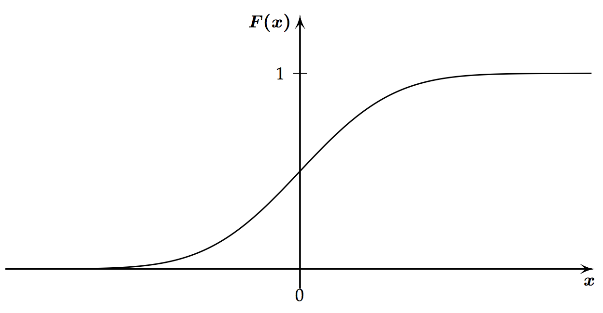

# 3 Modelle für Messdaten

## Stetige Zufallsvariablen und Wahrscheinlichkeitsverteilung

* Oft Messdaten statt Zähldaten
* Diese können jeden Wert in bestimmten Bereich annehmen
* Genauigkeitsangabe durch Messgenauigkeit vorgegeben

### Diskrete Wahrscheinlichkeitsverteilung

* Zufallsvariable $X$
* Wertemenge $W_X$
* Wertemenge besteht aus endlich vielen **ganzen** Zahlen (diskret)
* Die Menge ist also löchrig
* Beispiel einer Realisierung von $X$: $X(Person) = 174$
* $x$ ist eine Zahl, $X$ ist eine Menge
* Wahrscheinlichkeit berechnen: 
	* $P(X = x)$: Wahrscheinlichkeit der Zahl $x$ 
	* $\to$ Anzahl Personen mit x durch Gesamtmenge von X

### Stetige Verteilung

* **nicht** löchrig (Wertemenge ist kontinuierlich)
* Wertemenge $W_X$ von Zufallsvariable $X$ = alle Werte die $X$ annehmen kann
* **Intervall**: z.B. (a, b]
* **runde Klammer** = Wert liegt ausserhalb des Intervalls
* **eckige Klammern** = Wert liegt innerhalb des Intervalls

> Notiz:

> Man hat eine Reihe von Daten, die alle gleichwahrscheinlich vorkommen. Je mehr Kommastellen man zulässt, desto mehr gegen null strebt die Wahrscheinlichkeit eine bestimmte Zahl zu ziehen. (i = Nachkommastellen)
> 
> $$\frac{1}{10^{i+1}}$$

### Wahrscheinlichkeitsdichte

* Die Wahrscheinlichkeitsdichte $f$ ist die Ableitung der kumulativen Verteilungsfunktion:

> $$f(x) = F'(x)$$

* bei experimentellen Messdaten verwendet,
* wo relative Häufigkeit in bestimmten Intervallen grösser als in anderen ist
* **Wahrscheinlichkeit einer stetigen Zufallsvariablen X** kann mit Wahrscheinlichkeiten aller Intervalle $(a, b]$ beschreiben werden,

> $$ P(X \in (a, b]) = P(a < X \leq b)$$
> 
> $$ P(a < X \leq b) = F(b) - F(a)$$

* Berechnen mit der kumulativen Verteilungsfunktion $F(x) = P(X \leq x)$

> Eigenschaften der **kummulativen Verteilungsfunktion**:
> 



> 
> 1. $0 \leq F(x) \leq 1$ (Wahrscheinlichkeit)
> 2. $F(-\infty) = 0$ (Wahrscheinlichkeit, dass Messwert kleiner als $-\infty$)
> 3. $F(\infty) = 1$ (Wahrscheinlichkeit, dass Messwert kleiner als $\infty$)
> 4. $F(x)$ ist monoton wachsend: $F(a) < F(b)$. Ableitung $F'(x)$ von $F(x)$ also immer grösser gleich 0

> Eigenschaften der **Wahrscheinlichkeitsdichte**:
> 
> 1. $f(x) \geq 0$, F(x) ist monoton wachsend
> 2. $P(a < X \leq b) = F(b) - F(a) = \int\limits_a^b f(x) dx$, Fläche zwischen a und b unter f(x)
> 3. $\int\limits_{-\infty}^\infty f(x) dx = 1$


## Kennzahlen von stetigen Verteilungen

### Erwartungswert
* Mittlere Lage der Verteilung von Daten: $\mu$
* Bei diskreter Verteilung z.B. Mittelwert oder Median

> $$\displaystyle E(X) = \mu x = \int\limits_{-\infty}^\infty x \cdot f(x) dx$$

### Standardabweichung
Selbe Bedeutung, wie bei diskreter Verteilung: $\sigma_x$

### Varianz
Selbe Bedeutung, wie bei diskreter Verteilung: $\sigma^2_x$

> $$\displaystyle Var(X) = \sigma^2_x = E((X - E(X))^2 = \int\limits_{-\infty}^\infty (x - E(X))^2 \cdot f(x) dx = E(X^2) - E(X)^2$$

### Quantile

Selbe Bedeutung, wie bei diskreter Verteilung:  $q(\alpha)$

## Wichtige stetige Verteilungen

* Im diskreten Fall gibt es Binomial- und Poisson-Verteilung
* Im stetigen Fall gibt es
	* uniforme Verteilung
	* Exponentialverteilung
	* Normalverteilung (Gauss-Verteilung)
	* Standardnormalverteilung

### Uniforme Verteilung

* "Ignoranz"
* Dichte ist konstant (gleichförmig)
* gleiche Wahrscheinlichkeit auf ganzem Wertebereich
* Zufallsvariable X ist Uniform verteilt, falls:

> $$ f(x) =
  \begin{cases}
    \frac{1}{b - a}  & \quad \text{falls } a \leq x \leq b \\
    0 & \quad \text{sonst}
  \end{cases} $$

#### python
Probability density function

```python
from scipy.stats import uniform

# An der Stelle x = 5, Intervall [1, 10]
uniform.pdf(x=5, loc=1, scale=9)
```

Falls $X \sim \text{Uniform}([1, 10])$:

```python
uniform.cdf(x = 5, loc = 1, scale=9)
```

Wahrscheinlichkeit $P(1.2 \leq X \leq 4.8)$:

```python
uniform.cdf(x = 4.8, loc = 1, scale=9) - uniform.cdf(x = 1.2, loc = 1, scale=9)
```

Uniform verteilte Zufallsvariablen:

```python
uniform.rvs(loc = 1, scale=9, size=5)
```

### Exponentialverteilung

* einfachste Modell für "Wartezeiten auf Ausfälle" (Lebensdauer)
* (Poissonverteilung: Anzahl Beobachtungen in einem festen Zeitintervall)
* **Exponentialverteilung**: Wahrscheinlichkeit für eine Lebensdauer
* $exp(x) := e^x$

> * Zufallsvariable $X$,
> * mit Wertebereich $W_x = \mathbb{R}^+ = [0, \infty)$
> * mit Parameter $\lambda \in \mathbb{R}^+$ 
> * heisst exponentialverteilt falls,
>
> $$ f(x) =
  \begin{cases}
    \lambda \cdot exp(-\lambda x)  & \quad \text{falls } x \geq 0 \\
    0 & \quad \text{sonst}
  \end{cases} $$
> 
> * Geschrieben als: $$ X \sim Exp(\lambda) $$
> 
> * kumulative Verteilungsfunktion dazu: $$ f(x) =
  \begin{cases}
    1 - exp(-\lambda x)  & \quad \text{falls } x \geq 0 \\
    0 & \quad \text{falls } x < 0
  \end{cases} $$
  
$\to$ Lambda muss oft aus Experimenten geschätzt werden.

#### Erwartungswert bei Exponentialverteilung

> $E(X) = \frac{1}{\lambda}$

#### Varianz bei Exponentialverteilung

> $Var(X) = \frac{1}{\lambda^2}$

#### Standardabweichung bei Exponentialverteilung

> $\sigma_x = \frac{1}{\lambda}$

#### python

```python
from scipy.stats import expon

# X ~ Exp(3), Wahrscheinlichkeit P(0 <= X <= 4)
expon.cdf(x=4, scale=1/3)
```

### Normalverteilung

* häufigste / wichtigste Verteilung für Messwerte
* Dichte der Normalverteilung ist symmetrisch um Erwartungswert
* Je grösser $\sigma$, desto flacher / breiter die Dichte

> * Zufallsvariable $X$
> * mit Wertebereich $W_x = \mathbb{R}$
> * mit Parametern $\mu \in \mathbb{R} und \sigma^2 \in \mathbb{R}^+$
> * ist normalverteilt falls,
> 
> $$ \displaystyle f(x) = \frac{1}{\sigma \sqrt{2 \pi}} \cdot exp \Big( -\frac{(x - \mu)^2}{2\sigma^2}\Big) $$
> 
> Geschrieben als: $$X \sim \mathcal{N}(\mu, \sigma^2)$$
> 
> kumulative Verteilungsfunktion dazu:
> $$ F(x) = \int \limits_{-\infty}^x f(y) dy$$

#### Erwartungswert bei Normalverteilung

> $E(X) = \mu$

#### Varianz bei Normalverteilung

> $Var(X) = \sigma^2$

#### Standardabweichung bei Exponentialverteilung

> $\sigma_x = \sigma$

#### python

```python
from scipy.stats import norm

# P(X > 130) (also 1 - P(X <= 130)), X ~ N(100, 15^2)
1 - norm.cdf(x=130, loc=100, scale=15)
```

### Standardnormalverteilung

* Normalverteilung $\mathcal{N} (0,1)$
* Normalverteilung kann immer in eine Standardnormalverteilung transformiert werden

#### Dichte bei Standardnormalverteilung

> $$ \phi(x) = \frac{1}{\sqrt{2 \pi}} exp \Big (-\frac{x^2}{2} \Big )$$

* python: `norm.cdf(x)`

#### kumulative Verteilungsfunktion bei Standardnormalverteilung

> $$ \Phi(x) = \int \limits_{-\infty}^x \phi(y) dy $$

* python: `norm.ppf(q)` <br>(probability point function ist Umkehrung von `cdf`)

## Funktionen einer Zufallsvariable

* Zu jeder Realisierung $x$ von $X$ gehört die Realisierung $y = g(x)$ von $Y$
* "Funktion als neue Funktion darstellen"
* solche Transformationen treten häufig auf

### Lineare Transformationen von Zufallsvariablen

* $y = g(x) = a + bx$

> Eigenschaften von linearen Transformationen einer Zufallsvariable
> 
> 1. $E(Y) = E(a + bX) = a + b(E(Y))$
> 2. $Var(Y) = Var(a + bX) = b^2 Var(X), \sigma = |b|\sigma_x$
> 3. $\alpha - \text{Quantil von Y} = q_Y(\alpha) = \alpha + bq_X(\alpha)$
> 4. $f_Y(y) = \frac{1}{b} f_X \Big(\frac{y-a}{b}\Big)$

### Standardisieren einer Zufallsvariablen

* X kann immer linear transformiert werden sodass,
* Erwartungswert = 0 und
* Varianz = 1 ist.

> $E(Z) = a + bE(X) = 0$<br>
> $Var(Z) = b^2Var(X) = 1$

> Standardnormalverteilung: 
> $$ Z = \frac{X - \mu}{\sigma} \sim \mathcal{N} (0,1)$$

### Nichtlineare Transformationen von Zufallsvariablen

> z.B. Quadratische Transformation:
> $$y = g(x) = x^2$$
> 
> Wie sonst auch:
> $$E[Y] = \int \limits_{-\infty}^{\infty} y \cdot f_y(y) dy$$


## Funktionen von mehreren Zufallsvariablen

* z.B. gleiche Grösse mehrmals messen
* Messungen $x_1, x_2, ..., x_n$ werden als Realisierungen $X_1, X_2, ..., X_n$ dargestellt
* $X_i$ ist die $i$-te Wiederholung von unserem Zufallsexperiment

> Summe:
> $$S_n = X_1 + ... + X_n = \sum_{i=1}^n X_i$$
> 
> arithmetisches Mittel:
> $$\overline{X}_n = \frac{1}{n} S_n$$

* Das arithmetische Mittel der Daten $\overline{x}_n$ ist eine Realisierung der Zufallsvariablen $\overline{X_n}$

### Unabhängigkeit und i.i.d Annahme

* z.B. ein Messwert beinflusst den nächsten nicht
* Wenn Zufallsvariablen $X_1, X_2, ..., X_n$ 
* unabhängig sind und
* alle dieselbe Verteilung haben
* dann schreiben wir: $X_1, X_2, ..., X_n i.i.d.$ (**i**ndependent, **i**dentically, **d**istributed)
* wir arbeiten meistens mit dieser Annahme
* Mit dieser Annahme gilt:

> $$E(X_1 + X_2) = E(X_1) + E(X_2)$$
> $$Var(X_1 + X_2) = Var(X_1) + Var(X_2)$$

### Kennzahlen von $S_n$ und $\overline{X}_n$

* Relative Häufigkeit von fairen Münzen: 

> $$\overline{X}_n = \frac{1}{n} \sum_{i = 1}^n X_i$$

* Kennzahlen von $S_n$

>$$E(S_n) = E(X_1 + X_2 + ... + X_n) = \sum_{i = 1}^n E(X_i) = n\mu$$
>$$Var(S_n) = \sum_{i = 1}^n Var(X_i) = nVar(X_i)$$
>$$\sigma(S_n) = \sqrt{n}\sigma_x$$

* Kennzahlen von $\overline{X_n}$

> $$E(\overline{X_n} = E\Big(\frac{X_1 + X_2 + ... + X_n}{n}\Big) = \frac{1}{n} \sum_{i = 1}^n E(X_i) = \frac{1}{n} n E(X_i) = \mu$$
> $$Var(\overline{X}_n) = \frac{1}{n^2} \sum_{i = 1}^n Var(X_i) = \frac{1}{n^2} n \sigma_x^2 = \frac{\sigma_x^2}{n}$$
> $$\sigma(\overline{X}_n) = \frac{\sigma_x}{\sqrt{n}}$$
> 
> Die Standardabweichung von $\overline{X}_n$ heisst auch der Standardfehler des arithmetischen Mittels.


### Gesetz der Grossen Zahlen

Für $