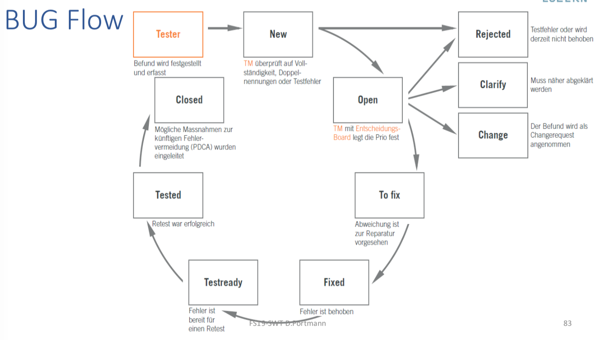

# Softwaretesten

# Warum unterstüzt Testen das Management?
- Steuerungsinstrument für nachhaltige Systemqualität
- Probleme und unnötige Kosten vermeiden
- Fehler früh und rechtzeitig erkennen
- TestmanagerIn = kompetente Ansprechperson für Management
- TestmanagerIn erabeitet faktenbasierte Entscheidungsgrundlagen
- Schafft Transparenz
- Beschleunigt Entscheidungsprozess
- Sichert Entscheidungen ab
- Liefert verlässliche Entscheidungsgrundlagen

## Der Nutzen vom Testen
- Testbudget kann eingeplant werden
- Testen wird Geld gespart
- Bessere Beschreibung der Anforderungen
- Fördert schnellere Entwicklung
- Besser Unterscheidung
    - Fehler
    - Änderungen
    - Neuanforderungen 

## Wie kommt es zu fehlerhaften Systemen?
* Fehlende Testfälle und Testszenarien
* Fehlende Planung 
    * Was zu Beginn nicht geplant wird, wird nie mehr aufgeholt
* Nicht vollständiges Testen
  (Zeitverzug kann dazu führen, dass Tests nur rudimentär durchgeführt werden)
* Fehlende zugeordnete Verantwortlichkeit (Rolle), welche sicherstellt, dass Tests auf folgende Punkte erarbeitet und durchgeführt werden
    * Vollständigkeit
    * Sinnhaftigkeit
    * Realitätbezug

## Codereviews
* Ein oder mehrere Personen überprüfen Code
* indem sie ihn oder Teile davon ansehen oder lesen
* 4 Augen Prinzip
* Der erste Schritt, um Fehler zu eliminieren
* Kostet am wenigsten

## Getestet wird immer
* Geplant und systematisch oder unerwartet und durch die Kunden

## Was ist das Ziel von Testen?
* Fehler möglichst früh(er) zu entdecken

## Warum ist Testqualität so wichtig
* Je höher die Testqualität desto mehr Fehler findet man (früh)

## Was macht ein Softwaretest?
* Prüft und bewertet Software auf Erfüllung der für ihren Einsatz definierten Anforderungen
* Misst ihre Qualität

## Das typische IT-Debakel
* Projekte enden nie
* Prozesse passen nicht
* Anforderungen wachsen stetig
* Projektleitung weiss nicht, wo sie steht

## Was kann man gegen das typische IT-Debakel machen?
* Agiles Vorgehen

**TODO "Wie kann agiles Vorgehen helfen?"**

## Vorteile von agilem Vorgehen
* kurze Zyklen bringen schnell Feedback
* CI / CD unterstützen schnelles Feedback
* Jede Teillieferung bringt Nutzen
* Wichtiges erfolgt zuerst

## Gefahren von agilem Vorgehen
* Ganzheitlicher (Test-) Ansatz fehlt (Teststrategie)
* Keine Negativ-Tests
* Keine Grenzwerttests
* Keine NFA - Tests
* Automatisierung erfolgt zu spät weil Produkt zu instabil

## Agiles Vorgehen aus Testsicht
* PO hat (zu) grosse Verantwortung
* PO hat oft wenig bis kein Testwissen
* Alle "können" alles
* Es gibt Akzeptanzkriterien (AK)
* Es gibt DOD (Definition of Done) und teilweise DOR (Definition of Ready)
* Es darf / muss Teststories geben, diese beinhalten folgende Tätigkeiten:
    * Codereview
    * Testanalyse
    * Tests bauen (auch automatisierte)
    * Testdaten
    * Tests durchführen

## Testrollen / Testtätigkeiten
* Testmanager (Führung)
* Testarchitekt, Testengineer (Ingenieur)
* Testanalyst (Ingenieur)
* Testdatenverantwortlicher (Informatiker)
* Tester (Fachperson)

## Testmanager
- Ansprechpartner für PL und Management in kritischen Phasen
- Plant Ressourcen, sucht und bewertet verschiedene Lösungen 
- Kann Leute mit unterschiedlichen Hintergründen führen
- Entwickelt Teststrategien
- Ist verlässlich und integer

## Testarchitekt / Testengineer
* Plant und entwickelt projektspezifische Testinfrastrukturen
* Entwickelt und verbessert Testmethoden
* Entwickelt und verbessert Testwerkzeuge
* Entwickelt Teststrategien und bringt sie in Projekte ein

## Testanalyst
* Leitet aus Anforderungen Testszenarien ab
* Entwickelt komplexe Testabläufe
* Bestimmt notwendige Testdaten

## Testdatenverantwortlicher
* Pflegt, verwaltet und bewirtschaftet Testdaten
* Kommuniziert mit Testanalysten, Fachvertretern und IT
* Betreibt Tools und Hilfsmittel zur Bewirtschaftung der Testdaten
* Erweitert Testdaten auf Basis der fachlichen Möglichkeiten

## Tester
* Führt zuverlässig und exakt Tests aus
* Dokumentiert präzis und neutral Ergebnisse und Abweichungen
* Reproduziert auf Wunsch die Testfälle
* Unterstützt die Testanalysten und IT-Spezialisten bei der Fehlersuche

## Testrollen in einem SCRUM-Team
> Fragen:
>
> * Wer ist für was verantwortlich?
> * Wo funktionierte dies gut?
> * Wo funktionierte dies nicht gut?

* Paradigma: Team für alles verantwortlich
* Team sollte Risikoanalyse machen können
* Team als Total sollte alles können
* Kleinere Teams für spezifische Rollen definieren
* QA: Test Analyst, Test Design, Test Daten
* TA: Test Architektur
* User: Tester
* SM: TM
* PO: TM

TODO

## Welchem Prozess folgt Testen?
1. Analysieren
2. Vorbereiten
3. Durchführen
4. Auswerten

## Testprozess Schritt 1: Analysieren
>  "Wie können Entwickler entwickeln, wenn Tester nicht wissen, was zu testen ist?"
* Anforderungen analysieren
* Teststrategie erstellen

(TODO)

## Teststrategie
* Bestimmt ob, was und wie getestet werden soll
* Dient dazu,
    * Vorgängig Gedanken zum Testvorhaben zu machen
    * Sich verbindlich an diese [Vorhaben] fest zuhalten
* Bestimmt das Test-Vorgehen
* Bennent verantwortliche Personen
* Bestimmt Prozess
* Etabliert notwendige Hilfsmittel

## Kluge Fragen beim Erstellen einer Teststrategie
* Was kann im Fehlerfall passieren?
    * Menschenleben, Gesundheit, Umwelt, Reputation, …
* Frage der Haftung und Garantie?
* Wie lange lebt das Projekt?
* In welchem Umfeld wird es eingesetzt?
* Wie komplex ist das Produkt?
* Was kostet das Produkt?
* Gibt es Gesetze, Vorschriften oder Normen? (Datenschutz)
* Welchen Standard haben vergleichbare Produkte?
* In welcher Liga wird das Produkt lanciert?
* Wie sicher soll oder muss das Produkt sein?

## Prioritäten einer Teststrategie
> Gute Strategie gibt nichts absolut vor, sondern wägt von Fall zu Fall die Prioritäten ab

* Tempo vor Sicherheit
* Design vor Funktionalität
* Tempo vor Stabilität
* Funktionalität vor Gesetzeskonformität
* Wartbarkeit vor Funktionalität
* Kafi vor Gruppenarbeit

## Weshalb Prioritäten
* Zeit / Geld reicht nicht immer für alles
* In hektischen Phasen bleibt nie genug Zeit, um alles zu testen
* Daher Tests sinnvoll priorisieren

(TODO Folie 55)

## Nach was Priorisieren?
> RPI: Risiko Prioritäts Index; nach Risiko priorisieren
* RPI bildet sinnvolle Methode, um zu priorisieren
    1. Vorgängig einzelne Anforderungen sinnvoll / zweckmässig gruppieren
    2. Relevante Bewertungskriterien bestimmen
* Bewährte Bewertungskriterien aus der Praxis
    * Businessrelevanz
    * Auffindbarkeit
    * Komplexität

## Businessrelevanz
* Wie gross ist Auswirkung im Fehlerfall?
    * Was ist der Schaden?
    * Wie gross ist der Nutzen?
    * Wie gross ist der Verlust?
* Wie schnell breitet sich Fehler an?
* Wie ansteckend / virulent ist Fehler?
* Was könnte Fehlerfall blockieren?

> Was nicht businessrelevant ist nicht testen

## Auffindbarkeit
* Wie schnell fliegt Fehler auf?
* Wie schnell zeigt sich Fehlverhalten?
* Wie gross ist Wahrscheinlichkeit, dass Fehler bemerkt wird?

> * Sachen, die nicht auffindbar sind unbedingt testen 
>   (stimmt das Drehmoment der Autoräder?)
> * Sachen, die offensichtlich sind nicht testen
>   (hat das Auto 4 Räder?)

## Komplexität
* Wie komplex ist Anforderung?
* Wie komplex ist Umsetzung?
* Wie komplex ist angewandte Technologie?
* Wie vernetzt ist das System?
* Wieviele unbekannte Grössen, Faktoren, Aspekte gibt es?

## Vorgehen RPI
> Risiko Prioritäts Index
1. Die drei Bewertungskriterien mit 1-3 bewerten
2. Das Produkt der drei Kriterien bilden
3. Den RPI mit Hilfe der Tabelle bestimmen
   (z.B. 1: very high | 5: very low)

## Was machen wenn zu vieles Priorität 1?
* Testumfang und Testtiefe variieren
* Weitere Unterteilungen

## Branchenspezifische Teststrategie
* Je nach Branche notwendig verschiedene Schwerpunkte für Teststrategie zu setzen

## Beispiele für branchenspezifische Schwerpunkte
> Kommt an der Prüfung!

* Bank
    * Korrekt / Genau
    * Tempo / Performance
    * [  ]
* Schreinerei
    * Perfekt
    * Kein Ausfall
    * [V]
* Gesundheit
    * Ausfall-Sicherheit
    * Zuverlässig
    * [  ]
* Öffentlicher Bereich / Kunden
    * Usability
    * [V]
* Rüstung
    * Korrektheit
    * [  ]
* Tourismus
    * Usability
    * Stabilität
    * [X]
* Marketing
    * Schnell beim Kunde
    * [X]

> [x] Time-To-Market vor Sicherheit
> [V] Vielleicht Time-To-Market vor Sicherheit
> [ ] Sicherheit vor Time-To-Market

(TODO)

## Qualitätsmerkmale nach ISO 25000 (9126)
* Funktionale Eignung
* Zuverlässigkeit
* Benutzbarkeit
* Leistungseffizienz
* Wartbarkeit
* Übertragbarkeit
* Sicherheit
* Kompatibilität

## Agiler Quadrant
TODO

eVoting "Hacker-Test" der Post TODO

## Testprozess, Schritt 2: Vorbereiten
>  „Tester“ und „Q-Menschen“ sind nie bereit, sie können die Testvorbereitung sowie die Testinfrastruktur problemlos vergolden.

* Testszenarien entwickeln
* Testumgebung vorbereiten
* Testablauf planen

## Multicolored
TODO

## Multicolored aus Testsicht

| Motivation, Treiber        | Fokus                                          | Nutzen                                  |
| -------------------------- | ---------------------------------------------- | --------------------------------------- |
| Formale Eintrittskriterien | Sind alle Vorbereitungen getroffen und belegt? | Voraussetzungen für Testaufwand gegeben |
| Vitalität                  | Schnelle Übersicht                             | Prüfen ob Testaufwand nötig             |
| Neue Funktionen            | Funktioniert Neues?                            | Ist der Weg der richtige?               |
| Gefixte BUGS               | Fatal und Urgent                               | Bugs binden Ressourcen                  |
| "Nur leicht modifiziert"   | Gibt es Kollateralschäden?                     | Stabiles System                         |
| Retest / Regression        | Funktioniert es noch                           | Stabiles System                         |
| Monkey und negativ         | Gewohnte Pfade verlassen                       | Nicht nur Schönwetter                   |
| Unvorhergesehenes          | Management                                     | Quick WIN und Akzeptanz                 |


## Weitere Testfarben
* Happy-Case
* Negativ-Test
* Grenzwert-Test
* Exeption-Test
    * viel
    * zu schnell / zu langsam / zu viel
    * andere Sprache / Farbe / Umgebung / Benutzer

## Betrachtungen zum Erarbeiten von Testfällen
> Testüberdeckung = Testabdeckung

* Testbedingung ist eine Äquivalenzklasse
    * Testüberdeckungselement ist meist auch eine Äquivalenzklasse
* Testbedingung ist ein Zustandsautomat
    * Je nach gewünschter Testtiefe ($$\to$$ Teststrategie) sind Testüberdeckungselemente einzelne Zustande, Übergänge zwischen den Zustanden oder bestimmte Sequenzen von Übergängen
* Testbedingung ist eine Grenze eines Wertebereichs
    * Je nach Testtiefe ($$\to​$$ Teststrategie) können Testüberdeckungselemente hier entweder die zwei Grenzwerte (erster Wert innerhalb und erster Wert ausserhalb des Bereichs an dieser Grenze) oder zusätzlich noch die Nachbarwerte dieser Grenzwerte sein
* Oft benennen Normen typische Testüberdeckungselemente

TODO: bessere Erläuterung

## Testbreite vs Testtiefe
* Testbreite
    * Viele verschiedene Testarten / -kategorien
* Testtiefe
    * Von bestimmten Testarten sehr viele oder detaillierte Tests
* Könnte an der Prüfung kommen mit einem Beispiel, wo wir sagen müssen mit welcher Strategie und welcher Testbreite / -tiefe man vorgehen soll

TODO: Auflösung in Klasse notieren

## Äquivalenzklassen
* Ähnliche Klassen bzw. Objekte 
    * Bezüglich Ein- und Ausgabedaten
    * Bei denen erwartet wird, dass sie sich gleichartig verhalten

## Ziel von Äquivalenzklassen
* Hohe Fehlerentdeckungsrate
* Mit möglichst geringe Anzahl von Testfällen

## Grenzwerte
* maximal zulässige Größen

## Grenzwert-Test
* Randwerte oder Grenzwerte testen
* Weil, Fehler treten häufig an den „Rändern“ der Äquivalenzklassen auf
* Simples Beispiel
    * 0,00 CHF (ungültige Eingabe)
    * 0,01 CHF (gültige Eingabe)
    * 500,00 CHF (gültige Eingabe)
    * 500,01 CHF (ungültige Eingabe)

## Negativ-Test
* Erweiterung des Positivtests
* Absichtlich ungültige Werte verwenden
* Nachweisen, dass die Anwendung robust auf Bedienfehler reagiert
* Prüft, ob Anwendung auf eine falsche Eingabe oder Bedienung, die nicht den Anforderungen entspricht, erwartungsgemäß (ohne Programmabbruch) reagiert (z.B. durch Fehlermeldung)

TODO

## Exception-Test
* Macht Anwendung was es soll auch im Ausnahmefall?
* Wirft sie die richtigen Exceptions?

TODO

## Tipps beim Erarbeiten von Testfällen
* Guter Mix aus Testbreite und -tiefe wählen
* Mix kann sich vortlaufend verändern
* Guter Mix aus Testarten
* Den jeweiligen Bedürfnissen folgen
* Risiken berücksichtigen
* Der Strategie folgen

<div style="page-break-after: always;"></div>

## Agile Testquadrant (Brian Marik)
```
                             Business-Facing
Automated & |-------------------------|--------------------------| Manual
     Manual |                         |                          |
            |  						  				  |		  Alpha / Beta		     |
            |     Functional Tests    |    Exploratory Testing   |
            |        Examples         |         Scenarios        |
            |       Story Tests       |     Usability Testing    |
            |        Prototypes       |  User Acceptance Testing |
  			    |                         |                          | 
 Supporting |                      Q2 | Q3                       | Critique
   the Team |-------------------------|--------------------------| Product
            |                      Q1 |	Q4						           |
            |	              					|							             |
            |	     				            |       Performance &      |
            |     	Unit Tests	      |       Load Testing       |
            |     Component Tests	    |     Security Testing     |
            |						              |		   "ility" Testing	   |
            |						              |							             |
  		      |                         |   		                   |
  Automated |-------------------------|--------------------------| Tools
  							               Technology-Facing
```

## Testprozess, Schritt 3: Durchfühen
* Release installieren
* Release testen

## BUG
* Fehler
* Fehlerhaftes, entgegen der aktuellen Beschreibung (UC) festgestelltes Verhalten

## Change
* Eine gewünschte und defininierte Änderung / Erweiterung zu einer bereits bestehenden Spezifikation

## Neue Anforderung
* Liegt nur dann vor, wenn gewünschte Änderung nicht auf einer bestehenden Beschreibung (UC) aufbaut oder diese um wesentliche zusätzliche Funktionalitäten ergänzt

## Bug Flow


## Bewertung einer Fehlerklasse
* -1 Low
    * Leichter Fehler
    * Betrifft einzelnen Testschritt
    * Funktion bleibt (grundsätzlich) gewährleistet
* -2 Medium
    * Betriebsstörend
    * Systemfunktion nicht beeinträchtigt
    * Wesentliches funktioniert, aber eingeschränkt
* -3 High
    * Schwerer Fehler
    * Auswirkung auf Funktion
    * Keine Auswirkung auf andere Funktionen / Systeme
* -4 Urgent
    * Fataler Fehler
    * Auswirkung auf ganzes System
    * Testabbruch

## Reproduzierbarkeit eines Fehlers
* $$A$$ : Eindeutig festgelegter, belegbarer und reproduzierbarer Fehler
* $$B$$ : Nicht ohne weiteres reproduzierbar, aber wiederholt aufgetreten
* $$C$$ : Nicht reproduzierbar

## SET
> Strukturiert Exploratives Testen

* Vorher definiertes Testziel / -fokus in vorgegebener Zeit getestet
* Use Cases
    * GUI-Fehler
    * Eingabefelder
    * Bedienbarkeit, ...
* Nach Zeitfenster tauschen Testpersonen Erkenntnisse auf
* Befunde gut dokumentieren
* Testfokus wird den Erkenntnissen / dem Fortschritt angepasst
* Strategie gibt Fokus und Intensität vor

## Tipps für SET
* Sei Entdeckerin / Forscherin
* Löse den Geist von spezifizierten Anforderungen
* Denke an Workflows / Eingaben an die niemand anders gedacht hat

TODO SET / ET gemäss Cem Kaner

## Testprozess, Schritt 4: Auswerten
* Testresultate auswertens
* Testbericht erstellen

TODO

TODO wie wird entschieden ob Tests gut oder schlecht?

## Werden Akzeptanzkriterien erfüllt F96?


## Testbericht
* TODO

## Überraschungen

* TODO

## Erfassen von Kennzahlen
* TODO

## Metriken und Kennzahlen
* Metriken
    * Statische Code-Analyse
    * Tools
* Kennzahlen
    * Müssen in einem Prozess definiert werden
    * Führungsinstrumente

F10
