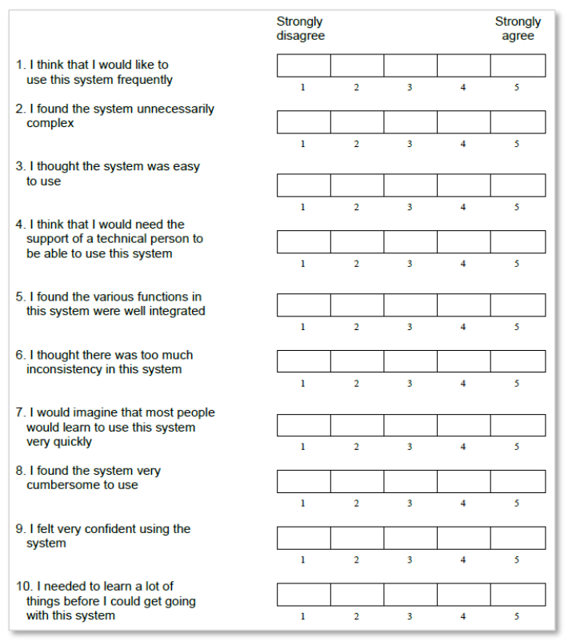
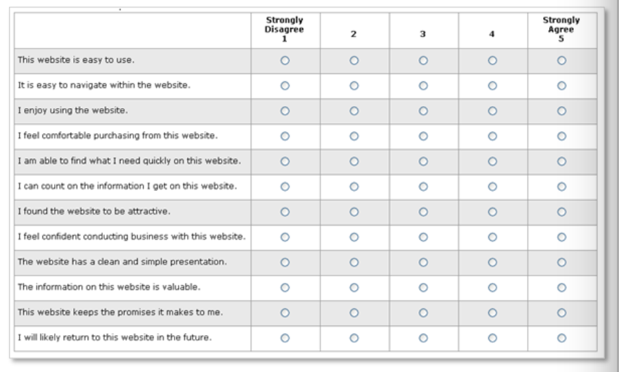

# Hypothesen / Forschungsfragen

## Hypothesen

## Forschungsfragen

### Interviewfragen

#### Einzelinterview

Grundsätzliche ähnliche Fragen wie beim Fragebogen, einfach leicht umformuliert. Fragen, wo man z.B. konkrete Antwortmöglichkeiten bietet beim Fragebogen könnten bei einem Interview offen gestellt werden, damit man vielleicht auf neues Wissen und neue Möglichkeiten stosst.

Umformulierte Fragen:

1. Wie wichtig sind ihnen die unten aufgelisteten Kriterien, wenn Sie von A nach B kommen müssen? $\to$ Welche Kriterien sind Ihnen am wichtigsten, wenn Sie von A nach B kommen müssen?
24. Kreuzen Sie die unten aufgelisteten Geräte an, falls Sie diese besitzen: $\to$ Welche elektronischen Geräte besitzen Sie, um auf das Internet zuzugreifen?
25. Was ist Ihnen am wichtigsten, wenn Sie eine App verwenden? Kreuzen Sie an was am meisten zutrifft: $\to$ Welche Kriterien sind Ihnen beim Verwenden einer App am wichtigsten?
26. Über welche Geräte würden Sie unseren Dienst eher benutzen? $\to$ Über welche Geräte würden Sie unseren Dienst benutzen?
27. etc.
28. siehe unten für weitere Fragen

### Fragebogen Allgemein

#### Kategorisierung
Als erstes könnten wir durch Fragen die Befragten in verschiedene Kategorien einteilen.

1. Wie alt sind Sie?
2. Welches Geschlecht haben Sie?
3. Kreuzen Sie an in welchem Bereich sich Ihr Einkommen befindet: (< 20'000, > 20'000, > 50'000, ...)
4. Welche Ausbildungen haben Sie abgeschlossen?
5. Welchen Beruf üben Sie aus?
6. Sind Sie Student?
7. Wo wohnen Sie?
8. Was sind Ihre Interessen / Hobbies?
9. Was machen Sie in Ihrer Freizeit?
10. Beschreiben Sie in einem Satz ihr Lebensmotto.
11. Beschreiben Sie in einem Satz ihre wichtigste Charaktereigenschaft.
4. Wie viele Personen sind in Ihrem Haushalt?
5. Wie viele Autos besitzen Sie und Ihre Familie?
6. Wie viele Autos stehen Ihnen zur Verfügung?
7. Besitzen Sie ein eigenes Auto?
7. Haben Sie einen gültigen Fahrausweis?
6. Wie oft pro Woche fahren Sie mit einem Auto?
7. Benutzen Sie oft öffentliche Verkehrsmittel?
8. Weswegen fahren Sie so oft, so wenig, nie mit einem Auto?
9. Weswegen fahren Sie so oft, so wenig, nie mit den öffentlichen Verkehrsmitteln?
10. Wie wichtig sind ihnen die unten aufgelisteten Kriterien, wenn Sie von A nach B kommen müssen? Kreuzen Sie an was am meisten zutrifft:
	11. [1 - 5] Privatsphäre
	12. [1 - 5] Ruhe
	13. [1 - 5] Sauberkeit
	14. [1 - 5] Pünktlichkeit
	15. [1 - 5] Geschwindigkeit
	16. [1 - 5] Flexibilität
	17. [1 - 5] Preis
	18. [1 - 5] Zuverlässigkeit
	19. [1 - 5] Sicherheit
	20. [1 - 5] Design
	21. [1 - 5] Technologie
	22. [1 - 5] Accessability
	20. [1 - 5] IHRE EIGENEN KRITERIEN
	21. [1 - 5] IHRE EIGENEN KRITERIEN
22. Haben Sie elektronische Geräte, um auf das Internet zuzugreifen?
23. Welche elektronischen Geräte verwenden Sie, um das Internet zu verwenden?
24. Kreuzen Sie die unten aufgelisteten Geräte an, falls Sie diese besitzen:
	25. [] Computer
	26. [] Smartphone
	27. [] Tablet
	28. [] Telefon
	29. [] Keines der obigen
29. Wie oft verwenden Sie die oben angekreuzten Geräte pro Woche / Tag?
30. Über welche Geräte greifen Sie auf das Internet zu?
31. Wie oft befinden Sie sich im Internet?
32. Verwenden Sie Apps auf Ihrem Smartphone?
33. Was ist Ihnen am wichtigsten, wenn Sie eine App verwenden? Kreuzen Sie an was am meisten zutrifft:
	34. [1 - 5] Sicherheit
	35. [1 - 5] Datenschutz
	36. [1 - 5] Flow
	37. [1 - 5] Geschwindigkeit
	38. [1 - 5] Preis
	39. [1 - 5] Technologie
	40. [1 - 5] Zuverlässigkeit
	41. [1 - 5] Design
	42. [1 - 5] Accessability
43. Würden Sie eine Applikation wie unsere:
	44. nie benutzen
	45. eher nicht benutzen
	46. vielleicht benutzen
	47. benutzen
	48. sicher benutzen
	49. immer benutzen
50. Weswegen Ihre Antwort oben?
50. Über welche Geräte würden Sie unseren Dienst eher benutzen?
	51. [] Computer
	26. [] Smartphone
	27. [] Tablet
	28. [] Telefon
	29. [] Keines der obigen
29. Könnten Sie sich vorstellen Ihr eigenes Auto zu verleihen?
30. Was wäre Ihnen dabei am wichtigsten? Kreuzen Sie an was am meisten zutrifft.
	31. [1 - 5] Versicherung
	32. [1 - 5] Zeitgerechte Bezahlung
	33. [1 - 5] Kommunikation mit anderer Partei
	34. [1 - 5] Datenschutz
	35. [1 - 5] Klare Regeln
	36. [1 - 5] Profil der anderen Partei
	37. [1 - 5] Einfache Übergabe
	38. [1 - 5] Gute Platzierung der eigenen Angebote
39. Könnten Sie sich vorstellen ein Auto auszuleihen?
40. Was wäre Ihnen dabei am wichtigsten? Kreuzen Sie an was am meisten zutrifft.
	31. [1 - 5] Versicherung
	32. [1 - 5] Zeitgerechte sichere Bezahlung
	33. [1 - 5] Kommunikation mit anderer Partei
	34. [1 - 5] Datenschutz
	35. [1 - 5] Klare Regeln
	36. [1 - 5] Profil der anderen Partei
	37. [1 - 5] Einfache Übergabe
	38. [1 - 5] Viele Angebote
	39. [1 - 5] Möglichst zutreffende Angebote
40. Haben Sie andere Produkte, die ähnliche Dienste anbieten bereits benutzt?
41. Wenn ja, was hat Ihnen gefallen?
42. Wenn ja, was hat Ihnen nicht gefallen?
43. Wie gehen Sie vor, wenn Sie einen solchen Dienst finden wollen?
	44. [] Google (oder andere Suchmaschinen im Web)
	45. Freunde / Familie fragen
	46. Zeitungen / Magazine
	47. Reklamen / Werbung
48. Wie oft verleihen Sie Ihr Auto, wie oft leihen Sie ein Auto aus?
49. Haben Sie ein Bedürfnis nach Rollstuhl zugänglichen Fahrzeuge?
50. Was wäre Ihr Budget für einen solchen Dienst?
51. Wie lange dauert es durchschnittlich bis Sie etwas einkaufen? 
	52. sehr lange
	53. lange
	54. immer unterschiedlich
	55. nicht lange
	56. schnell
	57. sehr schnell
58. Beschreiben Sie Ihr Kaufverhalten in einem Satz.
59. Recherchieren Sie oft bevor Sie ein Produkt kaufen?
60. Recherchieren Sie oft nach Alternativen?
61. Nach welchen Kriterien suchen Sie, wenn Sie sich über ein Produkt erkundigen?
62. Welche Probleme motivieren Sie Produkte nach Produkten zu suchen?
63. Was wäre ein kritisches Feature, das unser Produkt besitzen müsste, damit Sie es verwenden würden?
64. Wie könnte unser Produkt Ihr Leben verbessern?
65. Like, Tweet, Connect, Follow

#### SUS (Validierte Fragebögen)
Eine System Usability Scale macht für uns noch wenig Sinn, da wir noch kein GUI zum Testen haben.

Skala von 1 bis 5 (1 = überhaupt nicht einverstanden, 5 = sehr einverstanden)

1. Ich würde dieses System oft benutzen
2. Ich fand das System unnötig komplex
3. Das System war einfach zu nutzen
4. Ich bräuchte technischen Support beim Benutzen dieses Systems
5. Die Funktionen in diesem System waren gut integriert.
6. Es gab zu viele Inkonsistenzen im System
7. Ich denke das System ist einfach erlernbar
8. Ich fand das System schwer zu nutzen
9. Ich fühlte mich selbstbewusst beim Nutzen dieses Systems
10. Ich musste mich zuerst Vorbereiten, um das System nutzen zu können

#### AttrakDiff

#### Super-Q

### Fragebogen Online

<a href="https://www.surveymonkey.com/welcome/sem/?&iv_=__iv_p_1_a_198111455_g_9751401815_c_227545042485_k_surveymonkey_m_e_w_kwd-153803139_n_g_d_c_v__l__t__r_1t1_x__y__f__o__z__i__j__s__e__h_1003230_ii__vi__&utm_source=adwords&utm_medium=ppc&utm_term=surveymonkey&utm_network=g&utm_campaign=Worldwide_Search_Alpha_Brand_(SP/NO/SW/FI/KO/CH/IT/DE)&cmpid=brand&cvosrc=ppc.google.surveymonkey&keyword=surveymonkey&matchtype=e&network=g&mobile=0&searchntwk=1&creative=227545042485&adposition=1t1&campaign=Worldwide_Search_Alpha_Brand_(SP/NO/SW/FI/KO/CH/IT/DE)&cvo_campaign=Worldwide_Search_Alpha_Brand_(SP/NO/SW/FI/KO/CH/IT/DE)&cvo_adgroup=surveymonkey&dkilp=&cvo_creative=227545042485&gclid=Cj0KCQjwzcbWBRDmARIsAM6uChU0Phr7Jy2KKvD-hx-vQIecaHcDDcfbRHjtlX7Djni87gDlXSXMZQAaAoIkEALw_wcB">survey monkey</a>
