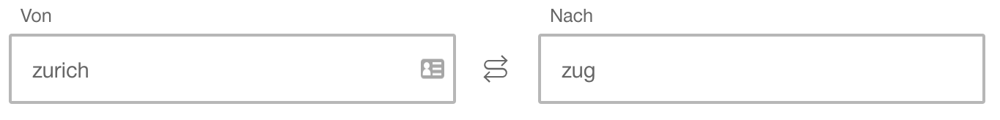
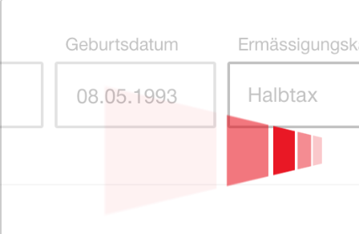

## SW02 Kurzübung SBB-Webseite

### Aufgabenstellung
Die Webseite der SBB (www.sbb.ch) beurteilen, anhand von ihrer Usability.

### Mögliche Musterlösung

#### Positiv

* man wird nicht überwältigt zu Beginn
* schnelle Suche nach einer Verbindung
* schöne Darstellung der Verbindungen
* Bestellprozess ist intuitiv

#### Negativ

* man wird überwältigt sobald man über z.B. "Bahnhof & Services" schwebt
* das Symbol zwischen den Verbindungen könnte entweder
	* 
	* hin-und-zurück-Billet darstellen
	* oder Richtung ändern, bedeuten
* GIF wirkt störend:  
* Abos sind sehr kompliziert aufgebaut. Schwierig zu finden, was man sucht