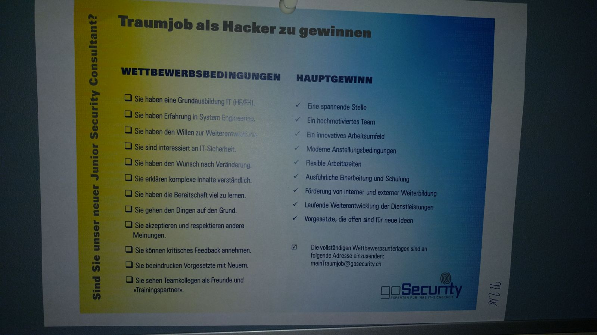
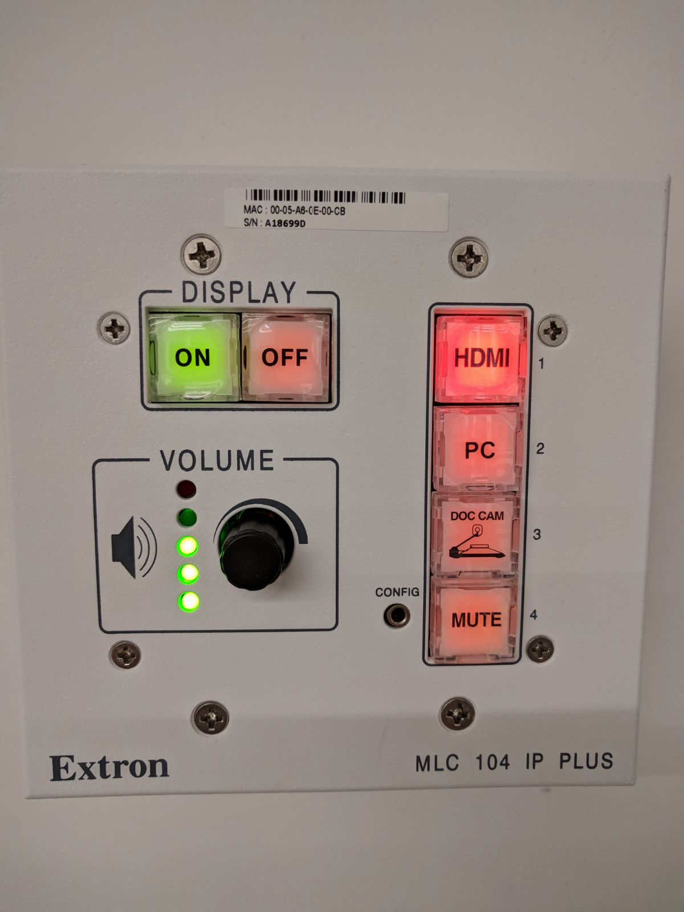

## SW03 Gestaltgesetze

### Gesetz der Nähe

#### Gutes Beispiel
Im WhatsApp-Chat werden die Nachrichten eines Nutzers durch grössere Abstände von den Nachrichten des anderen Nutzers getrennt, sprich durch kleinere Abstände gruppiert. 

#### Schlechtes Beispiel
Hier könnte man aber auf die schlechte Anwendung des Gesetz der Nähe hinweisen. Der Titel der linken Liste ist zu lange und könnte mit dem Titel der rechten Liste als Haupttitel misinterpretiert werden. Der Abstand zwischen den Titeln und den Listenelementen ist wiederum eher gross, weshalb der Bezug dazu nicht augenblicklich hergestellt wird.

---

### Gesetz der Ähnlichkeit

#### Gutes Beispiel
Durch die Checkboxes wird die Liste links von der Liste rechts mit seinen Häckchen getrennt (Gleiches mit Gleichem). 

#### Schlechtes Beispiel
Da die Formen alle etwa gleich aussehen und trotzdem nicht und dazu noch abwechselnd gleiche/andere Funktionen erfüllen ist dieses Interface verwirrend.

---

### Gesetz der Geschlossenheit

#### Gutes Beispiel
Die einzelnen Hauptfunktionen **DISPLAY**, **VOLUME** und **CONFIG** sind klar durch ihre Rahmen geschlossen und voneinander getrennt.

#### Schlechtes Beispiel
Auf diesem Anschlagsbrett sieht man nicht, was mit was in Beziehung steht. So können kaum Gruppierungen erstellt werden, was zu einer Überladenheit führt. Eine einfache Sortierung würde das Anschlagbrett sowohl lesbarer als auch attraktiver machen.

---

### Gesetz der Tiefenwahrnehmung

#### Gutes Beispiel
Auf dem Label einer Knutwiler Mineralwasserflasche sieht man ein Muster, welches an einen Berg erinnert. Durch die geringeren Kontraste auf dem Gipfel des Berges scheint sich dieser auch weiter hinten zu befinden.

#### Schlechtes Beispiel

Durch das, dass auf diesem Heizofen keine Tiefe auf den Knöpfen vorhanden ist, merkt man nicht, dass diese Knöpfe überhaupt Knöpfe sind. Diese Täuschung wird zusätzlich verstärkt, dadurch dass der Ofen mit einer Fernbedienung geliefert wird.

Ofen mit weissen Knöpfen:

Fernbedienung mit denselben Knöpfen:

