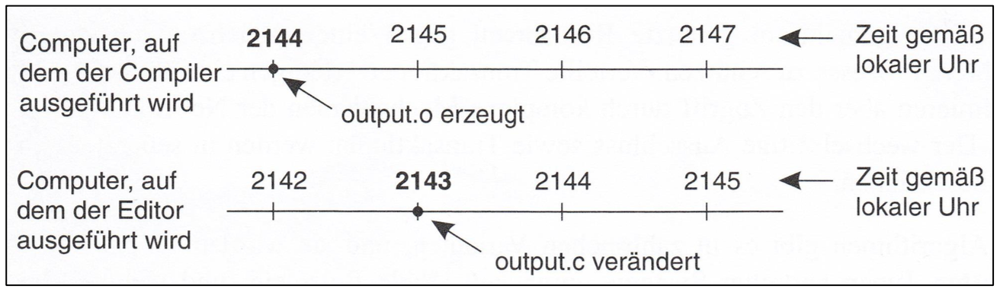
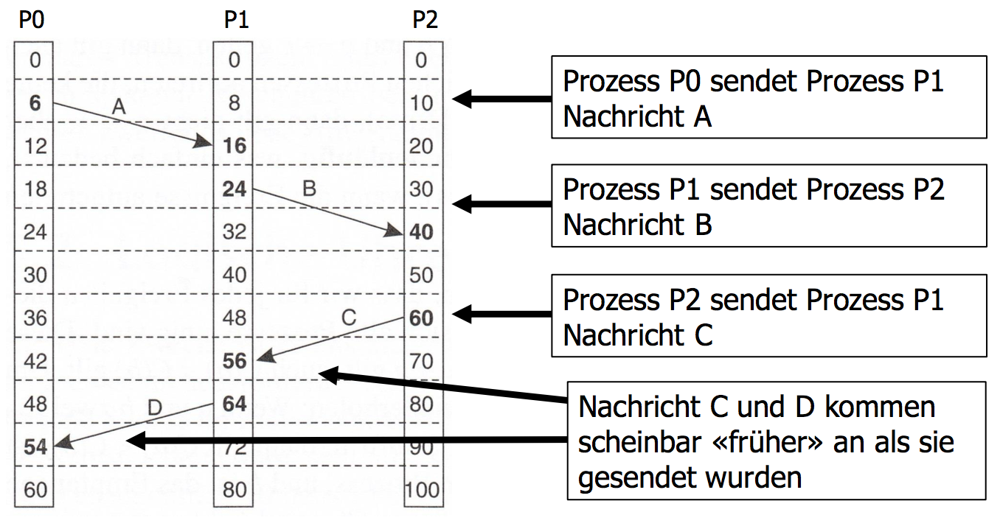
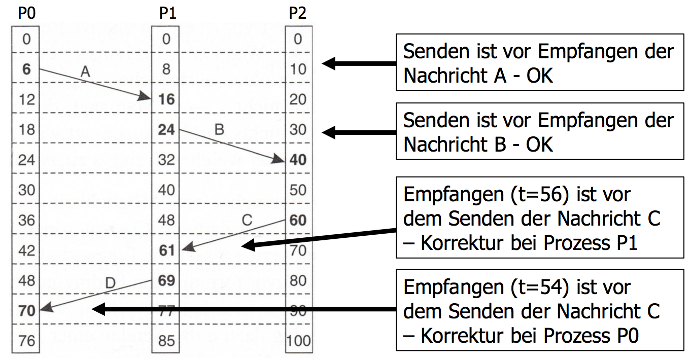

# Uhren Synchronisation

## Physische Uhren
Falls keine globale Einigung auf Zeit, ist folgendes Szenario denkbar:

**Konsequenz**: make wird nicht aufgerufen (Mischung aus alten/neuen Dateien)

**Voraussetzung für Uhr-Sync**:

* **Timer**: Schaltung in Computern, welche Zeit verwaltet
* **Uhr-Tick**: ein, durch Timer erzeugter Interrupt
* **Uhr-Asymmetrie**: Unterschiede von Zeitwerten versch. Uhren, auch wenn diese ursprünglich synchronisiert waren

### Algorithmus von Cristian (Passives System)

* **Zeit-Server**: Maschine mit Zeitzeichen-Empfänger, mit diesem werden alle anderen Maschinen synced.

* Client **P** erfragt Zeit von Zeit-Server **S** zum Zeitpunkt $t_0$
* Anfrage wird von **S** verarbeitet (benötigt Zeitspanne $I$)
* Antwort $C_{UTC}(t_1)$ wird von **P** bei $t_1$ empfangen
* **P** wird auf Zeit $C_{UTC}(t_1) + \frac{RTT}{2}$
	* Round Trip Time $RTT = t_1 - t_2$
	* Wenn Zeitspanne $I$ bekannt, kann Berechnung durch $RTT = t_1 - t_2 - I$
* Für genauere Werte wird die Laufzeit öfters gemessen, Messungen ausserhalb eines Bereiches werden verworfen und eine Mittelung der restlichen Werte durchgeführt

**Probleme**: 

* Zeit kann nicht rückwärts laufen
* Antwort des Zeitservers braucht Zeit

### Berkeley-Algorithmus

* Keine Maschine hat Zeitzeichen-Empfänger
* Zeit-Server (daemon) fragt periodisch alle Maschinen nach Zeit
* Basierend auf Antworten berechnet Zeit-Server Durchschnittszeit und weist alle Maschinen an, ihre Uhren anzupassen

### Networt Time Protocol (NTP)

* **Zweck**: Synchronisierung von Rechneruhren im Internet
* **NTP-Dämon** auf allen Rechnerplattformen
* Erreichbare Genauigkeiten von ca. 0.01s in WANs und 1ms in LANs
* Fehlertolerant

**Struktur**:

* Stratum 1: primärer Zeitgeber an amtliche Zeitstandards angebunden (Funk/Standleitung)
* Stratum > 1: synced mit Zeitgeber des Stratums i-1
* Stratum kann dynamisch wechseln (Unterhalt/Ausfall)

## Logische Uhren

* ausreichend, wenn alle Maschinen über Zeit einig sind
* Übereinstimmung mit Zeit ausserhalb Systems nicht nötig
* wo Kausalität/Verlässlichkeit wichtig
* ineffizient

**Happened-Before-Relation von Lamport**:

* Ausdruck $a \to b$ gelesen als "a passiert vor b"
	* d.h. alle Prozesse sind sich einig, dass
	* zuerst Ereignis $a$ stattfindet dann $b$
* Direkte Beobachtung der Relation in zwei Situationen:
	1. wenn $a$ und $b$ im selben Prozess, und $a$ vor $b$, dann gilt $a \to b$
	2. wenn $a$ Senden einer Nachricht bei einem Prozess und $b$ Empfangen derselben Nachricht bei anderem Prozess ist, dann gilt $a \to b$
* $a \neq b$: kausal unabhängig
* **Transitive Relation**: wenn $a \to b$ und $b \to c$, dann $a \to c$

## Lamport-Zeitstempel

**Ausgangslage**: Jede Maschine hat eigene Uhr mit konstanten aber unterschiedlichen Geschwindigkeiten. 

**Lamport-Zeitstempel**:

* Prozess sendet Nachricht mit eigener Uhrzeit an anderen Prozess
* Ereignis $a$ wird Zeitwert $C(a)$ zugeordnet
	* alle Prozesse sind sich über Zeitwert einig
	* wenn $a → b$ auch $C(a) < C(b)$
* Prozess sendet eine Nachricht mit eigener Uhrzeit $a$ an anderen Prozess, welcher Nachricht zur eigenen Zeit $b$ empfängt, dann müssen $C(a)$ und $C(b)$ so zugewiesen werden, dass $C(a) < C(b)$ ist.
* Uhrzeit $C$ muss immer vorwärts laufen.
* Korrekturen durch Addition von Positiven Werten

**Lösung**: Zwischen zwei Ereignissen muss die lokale Uhr mindestens einmal ticken – empfangene Zeit + 1

**zusätzliche Forderung**:

* nie zwei Ereignisse gleichzeitig auftreten
* **Lösung**: Prozessnummer dem Zeitstempel hinzufügen
* Damit kann allen Ereignissen in verteiltem System Zeit zugewiesen werden. Folgende Bedingungen genügen:
	1. wenn $a$ im selben Prozess vor $b$ auftritt, gilt $C(a) < C(b)$ 
	2. wenn $a$ und $b$ Senden und Empfangen einer Nachricht
darstellen, gilt $C(a) < C(b)$
	3. für alle anderen Ereignisse $a$ und $b$, gilt $C(a) \neq C(b)$

**Eigenschaften**:

* erfüllen Uhrenbedingung
* definieren partielle Ordnung auf Menge der Ereignisse, die kausalen Zusammenhang zw. Ereignissen erhält
* Ergänzung zur totalen Ordnung möglich
* **Problem**: Unklar ob zwei Ereignisse kausal voneinander abhängig

## Vektor-Zeitstempel

* Ein Vektor-Zeitstempel $VT(a)$, der einem Ereignis $a$ zugewiesen wurde, hat die Eigenschaft, dass Ereignis $a$ dem Ereignis $b$ kausal vorausgeht, wenn $VT(a) < VT(b)$ für ein Ereignis $b$ gilt.
* Jeder Prozess $P_i$ besitzt einen Vektor $V_i$, der für jeden Prozess im System die Anzahl der Ereignisse enthält mit den Eigenschaften:
	- $V_i[ i ]$ ist die Anzahl der Ereignisse, die bisher in $P_i$ aufgetreten sind
	- wenn gilt $V_i[ j ] = k$, erkennt $P_i$, dass in $P_j$ $k$ Ereignisse aufgetreten sind.
* Der Vektor $V_i$ wird den gesendeten Nachrichten mitgegeben.

**Algorithmus**:

* Jeder Prozess $P_i$ hält einen Vektor $V_i$ bestehend aus $n$ Zählern ($n = Anzahl Prozesse im System$).
* Initial ist der Vektor-Zeitstempel jedes Prozesses der Nullvektor. 
* Tritt bei Prozess $P_i$ ein Ereignis auf, so inkrementiert er die $i$-te Komponente seines Vektor.
* Sendet $P_i$ eine Nachricht, so wird die neue Version von $V_i$ mitgeschickt.
* Empfängt $P_i$ eine Nachricht mit Vektor-Zeitstempel $VT$, so bildet er das komponentenweise Maximum von der neuen Version von $V_i$ und von $VT$.

**Vektor-Uhren**:

* definieren partielle Ordnung
* Komponentenweise Max Bildung zweier Vektoren $max(V_i, V_j) := (max(V_i [1], V_j [1]), ..., max(V_i [n], V_j [n]))$
* Komponentenweiser Vergleich: $V_i <V_j \to V_i \neq V_j$ und für $k$ von $1..n$ gilt $V_i[k] ≤ V_j[k]$

**Info des Vektor-Zeitstempel**:

Informiert Empfänger über:

* Anzahl Ereignisse in $P_i$
* wie viele Ereignisse in anderen Prozessen der Nachricht vorausgegangen sind,
* wie viele vorangegangene Ereignisse möglicherweise kausal abhängig sind