# Javascript

---


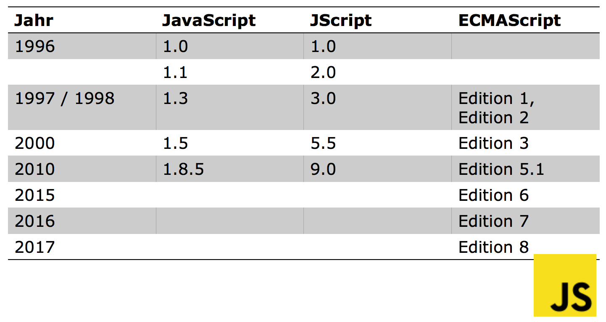

## Strict Mode

* `"use strict";` zuoberst im JS-File.
* Verlangt dass man,
	* Variablen deklariert (`var`)
	* Objekte deklariert
	* und vieles mehr ...

## Objekte, Object Literals

* Deklaration:

```javascript
var bachelorModule = {
title: "WebApplication Development", instructor: "Thomas Koller"
};
```

* Properties hinzufügen	

```javascript
bachelorModule.credits = 3;
```

* Properties löschen

```javascript
delete bachelorModule.credits;
```

* Getters / Setters ES5

```javascript
var otherModule = {
course: "WebApp",
semester: "F15",
get title() {return this.course + this.semester},
set title(value) {}
};
```

* Objekt mit `new` erzeugen

```javascript
var masterModule = new Object();
```

* Objekt mit `create` erzeugen

```javascript
var doctoralModule = Object.create(Object.prototype);
```

* Objekt mit anderem Objekt als Prototype

```javascript
var doctoralModule2 = Object.create(bachelorModule);
```

## Arrays

* Sparse Array

```javascript
let a = [];
a[1000] = "thousand";
```

* Array Reduce Beispiel

```javascript
let sum = a.reduce((x, y) => { return x + y; };
```

## Functions

* Function Literal (anonym)

```javascript
let add = (a, b) => { return a + b; };
```

* Function Literal (mit Name)

```javascript
let subtract = function subtract(a, b)  { return a - b; };
```

* Function Declaration Statement

```javascript
function mult(a, b) { return a * b; };
```

## Hoisting

Variablen haben Block Scope und nach oben auf die ersten Linien in ihrem Scope gehoisted.

```javascript
function log () {
	console.log(a); // funktioniert
	let a;
	console.log(b); // funktioniert nicht
}

function declare () {
	let b = 5;
}
```

## Immediate Function Invocation

```javascript
let fiveToThePowerOfTwo = function (x) { return x * x; }(5);
```

## Constructors

```javascript
function Name(vorname, nachname) { 
	this.vorname = vorname; 
	this.nachname = nachname;
}

let name = new Name("John", "Doe");
```

## Prototype

*  (Jedes) Objekt enthält (implizit) ein `prototype` Objekt
*  Wird ein Property nicht im Objekt selber gefunden, so wird es (rekursiv) im `prototype` Objekt gesucht
*  Das letzte Objekt (i.e. Object) in der Kette hat den Prototyp `null`
*  Mit Hilfe der Methode Object.getPrototypeOf() (ES5) kann explizit auf den Prototype zugegriffen werden

* Einem Circle-Prototype eine neue Methode zuweisen

```javascript
function Circle() { 
	this.radius = 1; 
	this.center = {x:0, y:0}
}

Circle.prototype.draw = function () { 
	console.log("Radius: " + this.radius);
};

let circle = new Circle();
c.draw();
```


## The Awful Parts of JS

* Global Variables
* Scope
* Semicolon Insertion
* typeof
* Eval
* Falsy values


## Embedding JS

* Inline `<script></script>`
* External File `<script src="something.js"/>`
* HTML event handler
* URL mit javascript: protocol

## Verarbeitung von JS

### Phase 1

1. Dokument wird geladen
2. Code `<script>` wird ausgeführt (synchron, asynchron oder defered)

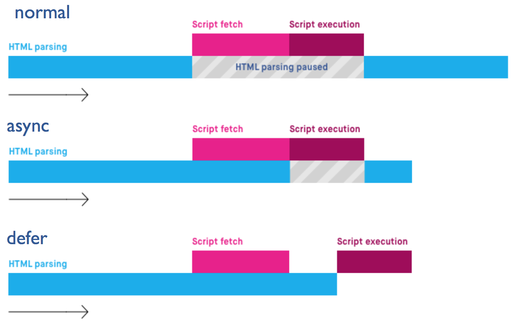

### Phase 2

3. Asynchrone Ausführung durch Event Handler

## Event Handlers

```javascript
window.addEventListener("load", function () => { ... }, false);
```

## Server Requests

### Example

```javascript
var request = new XMLHttpRequest();
request.open("GET", "data.json" /* url */);
request.setRequestHeader("Content-Type", "text/plain"); 
request.send(null /* body */);
request.onreadystatechange = function() { 
	if (request.readyState === 4 && request.status === 200) {
		var type = request.getResponseHeader("Content-Type"); 
		if (type.match(/^text/)) {
			// do something with request.responseText()
		} 
	}
}
```

### XMLHttpRequest readyState

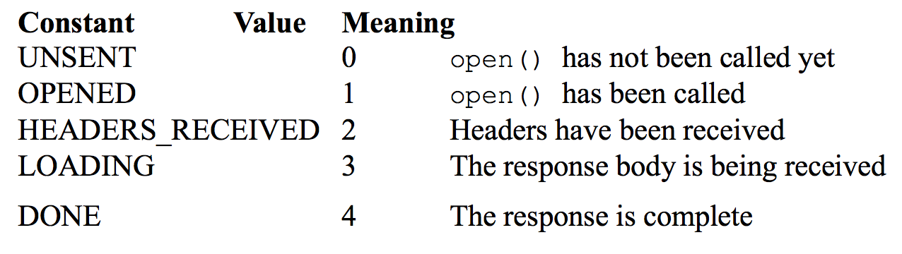

### JQuery Http-Request

```javascript
jQuery.ajax({
	type: "GET", // The HTTP request method.
	url: url, // The URL of the data to fetch. data: null, // Don't add any data to the URL. 
	dataType: "script", // Execute the response as a script once we get it.
	success: callback // Call this function when done.
});
```

## Asynchronous Programming

* JS ist **single threaded** (run-to-completion)
* Falls keine Event Listener einem Event zugeordnet sind, so ist der Event verloren

### Möglichkeigen für asynchrone Programmierung

* Callback, hat jedoch seine Probleme:
	* Callback pyramid of hell
	* Keine returns
	* Keine throws (kein call stack)
	* Keine garantierte Ausführung
* Promises
	* Observer Pattern
	* Hat call stack
	* Hat viele Garantien
	* Verketten der Callbacks möglich

	
### Promises

Zustände:

* pending (instanziert)
* fullfilled (erfolgreich ausgeführt)
* rejected (nicht erfolgreich)
* settled (fullfilled oder rejected)

Beispiel:

```javascript
let promise = new Promise((resolve, reject) => {

	/* asynchrone Aufgabe hier */

	if (/* hat geklappt */) {
		resolve("Hat funktioniert");
		return false;
	}
	
	reject(Error("Hat nicht geklappt");
});

promise.then((result) => {
	console.log(result);
}, (error) => {
	console.log(error);
});
```

Methoden:

* `Promise.all([promise1, promise2, ...]).then(...`
* `Promise.race([promise1, promise2, ...]).then(...`
* `Promise.reject(value)`;
* `Promise.resolve(5)`;

Nach asynchronem Task:

* `.then(...`
* `.catch(onRejection)`
* `.finally(...`


# Typescript

---

Javascript hat seine Schwächen:

* Prototype Inheritance
* Weak Typing
* Für Client Side Event-Handlich konzipiert
* Keine Modul- / Klassenkonzepte
* Keine Interfaces
* Code nicht lesbar

Lösung:

Sprachen die nach Javascript kompilieren wie,

* Typescript
* CoffeScript
* GWT, etc.

## Grundkonzepte

* Typescript hat BlockScope (`let`) nicht nur FunctionScope
* Types
* Ambient Declarations
* Funktionen mit Types und optionalen und default Parametern
* Interfaces und Klassen
* Inheritance
* Modules
* Hat `readonly` Attribute
* Wirft Errors dort wo JS einfach undefined zurückgeben würde

## Interface: Function Types

```typescript
interface SearchFunc {
	(source: string, subString: string): boolean;
}

let mySearch: SearchFunc;
mySearch = function (source: string, subString: string) {
	let result = source.search(subString);
	return result > -1;
	...
```

## Klassen

```typescript
class BachelorModule { 
	private _title: string;
	private _credits: number;
	
	constructor(title: string, credits: number) { 
		this._title = title;
		this._credits = number;
	}
	
	get title(): string { 
		return this._title
	} 
}

let webApp = new BachelorModule("WebApp"); console.log(webApp.title); // OK
console.log(webApp._credits); // Error
```

## Inheritance

```typescript
class BDAModule extends BachelorModule { 
	private _expertName: string;

	set expertName(name: string) { 
		this._expertName = name;
	} 
}

let bda = new BDAModule("SomeTitle");
```

## Generics

```typescript
function identity<T>(arg: T): T { 
	return arg;
}

let out = identity<string>("Hello");
console.log(out);
```

# Professionelles Client-Side JS

* Libraries / Framework
* Design (Modules, Files, etc.)
* Build Environment:
	* Linting
	* Testing
	* Packaging (minification, concatenation, ...)
	* Deployment

## Problem: neues Projekt 

Wo gehört was hin? Was brauche ich?

Lösungen:

* HTML5 Boilerplate: Alles was es braucht um ein Web Projekt aufzusetzen
* Yeoman: Erstellt das Gerüst von neuen Web Applikationen
* Angular CLI, Angular WebPack


## Problem: Basic CSS

* Responsive Design
* Initiales Aussehen auf verschiedenen Browsern unterschiedlich

Lösungen:

* Bootstrap (mit Grid System)
* Skeleton
* Foundation
* andere Frameworks

## Modularisierung

* CommonJS
* Require.js

# Entwicklung SPA

SPA Evolution ab 2010:

* Browser als Betriebssystem
* Immer mehr browserbasierte Programme
* Ausbau Hardware Zugriff aus Browser

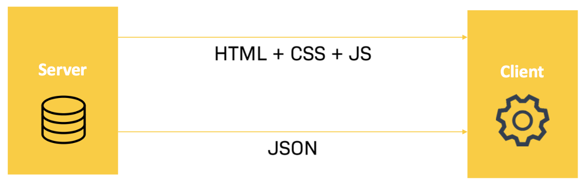

Renderzeit Client / Server

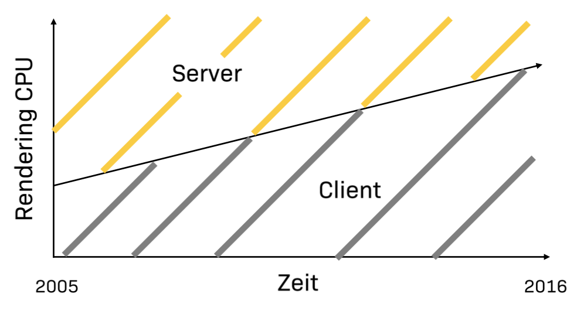


## Desktop vs. Web

Web:

* kein Backup nötig
* kein Update
* Skalierbar
* Investitionskosten $\downarrow$
* Setupkosten $\downarrow$
* Pay as you go

Desktop:

* Security
* Daten Hoheit
* Hardware Zugriff
* Features des OS
* Kalibrierte Systeme

## SPA

* Rich Client App im Browser
* Reines HTML5 + JS (kein Plugin)
* Kein erneuter Page reload
* Back-Button funktioniert (history)
* Links sind Bookmarkbar
* "Funktionalität offline zu gehen"
* Harmoniert mit Restful Web Services

### SPA Komponenten

* Routing (Navigation)
* Template-Rendering (View)
* (Remote-) Daten Zugriff
* Modularisierung der Codes

### Routing URL

URL Beschreibt Inhalt


* history.pushState:

```typescript
var stateObj = { foo: "bar" };
history.pushState(stateObj, "page 2", "bar.html");
```

### Template Rendering & Binding

* Entkopplung UI <=> Code
* Einfache Testbarkeit
* Update Notifikation
* Reduzierung von Push / Pull Code
* Binding

HTML (View):

```html
<h1>{{ name }}</h1>

<button click="do()">do</button>
```

z.B. Angular (Model / Controller):

```typescript
function do () { name + " 1"; }

var name = "Hans"; // (name gebunden an html)
```

### Modularisierung

* Klare Strukturierung
* Sepparatoin of Concern
* Single Responsibility
* Einfache Wartbarkeit
* Einfache Testbarkeit


# Angular

* SPA Framework für CRUD Anwendungen
* Basierend auf Typescript
* Wenig Boilerplate Code
* Dependency Injection
* Performantes 2-Way Binding
* Komponentisierung / Modularisierung
* Anzeige von Daten durch Components
* Full Stack

## Angular Architektur

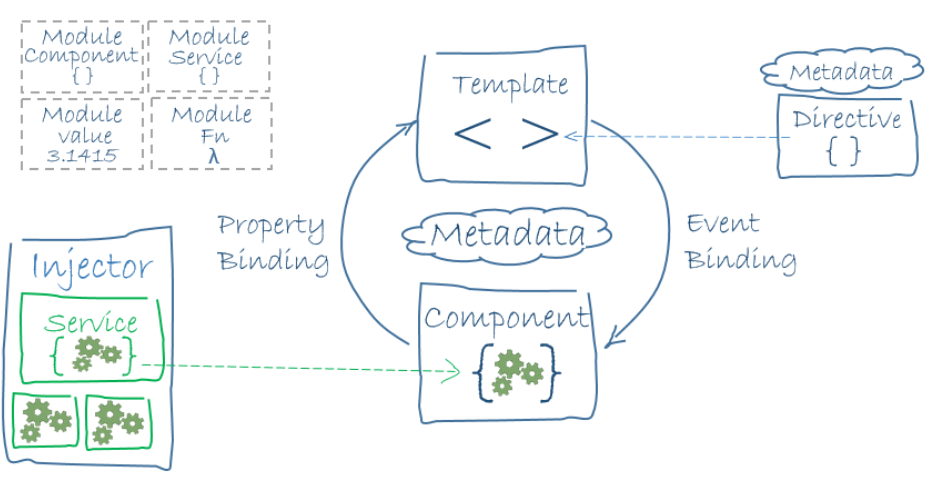

* **Modules**
* **Compontent**: Model, Controller
* **Templates**: View
* **MetaData**: Binder, Tells Angular what to do<br>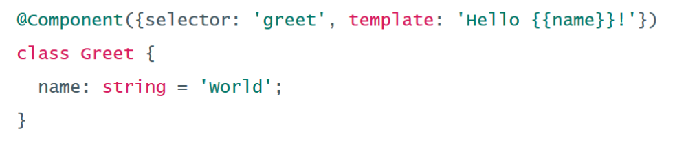
* **Data** Binding: User Responses $\to$ Action<br>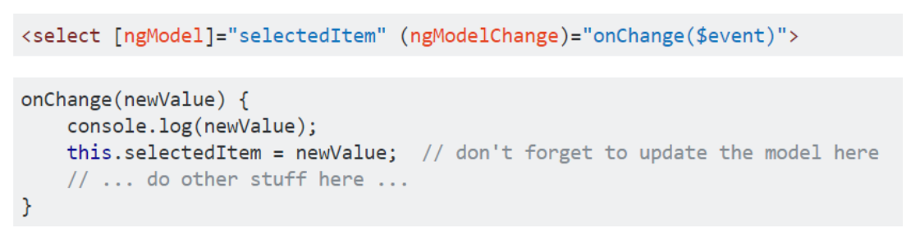
* **Directives**: a component is a directive-with-a-template
* **Services**: Container for any value, function, feature for app
* **Dependency** **Injection**: alles wird im Container registreirt, damit es jeder verwenden kann

## Konstrukte

z.B. :

* `*ngIf="someCondition; else falsyTemplate`
* `*ngFor`
* `<ng-template #falsyTemplate></ng-template>`

## NgModules

* `imports`: dependencies
* `declarations`: was zu einem Modul gehört (Compontenten, Directiven, Pipes)
* `exports`: "subset of declarations that should be visible and usable in the component templates of other NgModules"
* `providers`: "Creators of services that this NgModule contributes to the global collection of services; they become accessible in all parts of the app."
* `bootstrap`: "The main application view, called the root component, which hosts all other app views. Only the root NgModule should set this bootstrap property."

```typescript
@NgModule({
	imports: [ CommonModule, FormsModule ], 
	declarations: [ ContactComponent, HighlightDirective, AwesomePipe ],
	exports: [ ContactComponent ],
	providers: [ ContactService ],
	bootstrap: [ AppComponent ]
})
export class ContactModule { }
```


# LAMP

---


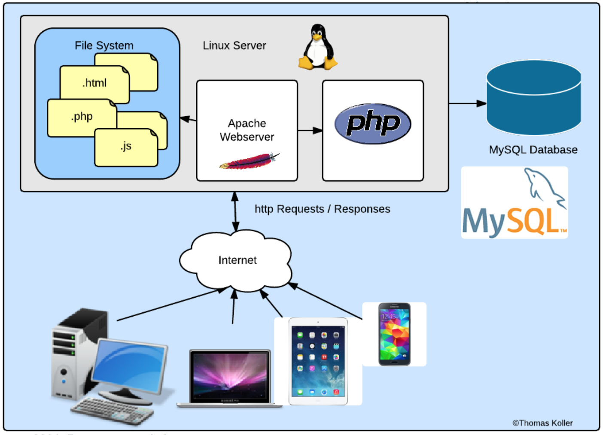

## Wie funktioniert PHP?

* Apache (Webserver) leitet http-Requests  für PHP Files an PHP Interpreter weiter
* Seite wird nach Verarbeitung durch Interpreter wieder an Apache geschickt (als HTML Seite)
* Browser sieht PHP nie!

## MySQLi Object Interface

```javascript
$db = new mysqli(host, user, password, databaseName);
$sql = "SELECT * FROM ... WHERE ..";
$result = $db->query($sql);
$row = $result->fetch_assoc();
echo $row["id"];
```

# HTML

---


## DOM-Klassenhierarchie

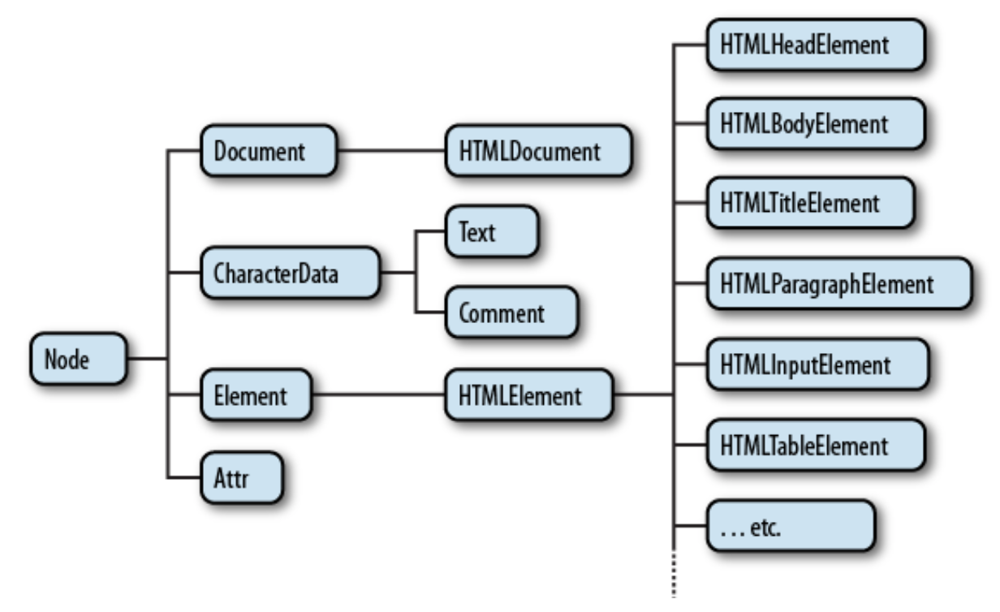

# CSS

---

## Embedding CSS

* Inline Style
* Inline Style Sheets
* External Style Sheets


# REST

Representation State Transfer

* Client-Server Modell
* Jede Anfrage an Server enthält notwendige Information damit Server diese bearbeiten (zustandslos)
* Cache

## Eigenschaften

* Einheitliche Schnittstellen mit 4 Constraints
	* Identifikation von Ressourcen
	* Manipulation der Ressourcen durch "Representationen"
	* Beschreibende Meldungen
	* Hypermedia as the engine application state
	* Schichten Code on demand

## RESTful APIs

WebService APIs die REST über HTTP anbieten.

Bestehend aus:

* Basis URI, die Ressource identifiziert
* Medientyp für Daten
* Standard HTTP Methoden
* Hypertext Links um Zustand zu representieren
* Hypertext Links auf andere Ressourcen

## Methoden

Definition von **safe** Methoden:

* keine Änderungsoperationen auf Daten (z.B. readonly)

Definition von **idempotent**:

* Mehrfache Durchführung ändert Daten nicht


## HTTP Methoden

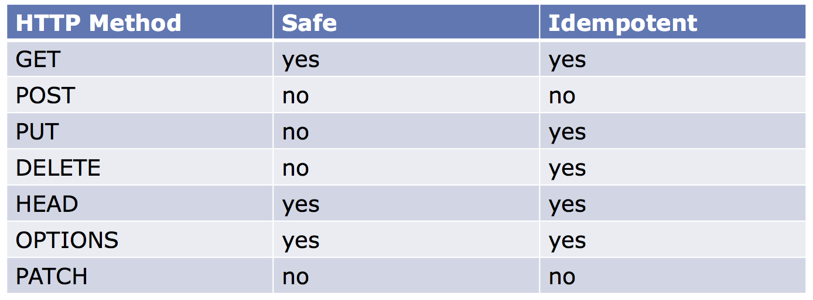

## HTTP Status Codes

* 200: OK
* 400: Bad Request
* 401: Unauthorized
* 403: Forbidden
* 404: Not Found
* 409: Conflict
* 418: I'm a teapot
* 500: Internal Server Error

## REST URI

* Resourcen eindeutig über Pfad addressierbar (Uniform Resource Identifier)

* URIs für Collection Interfaces

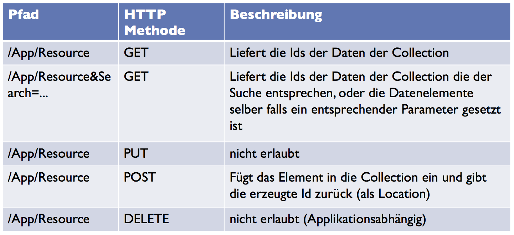

* URIs für Element Interfaces

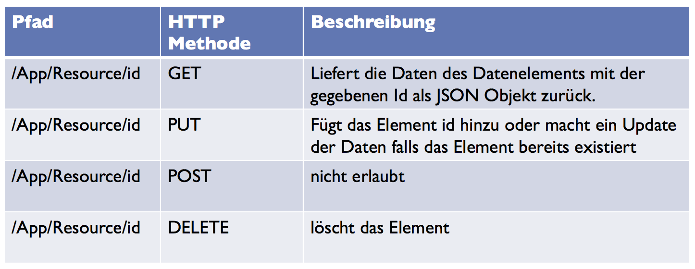

* Return Codes für Collection

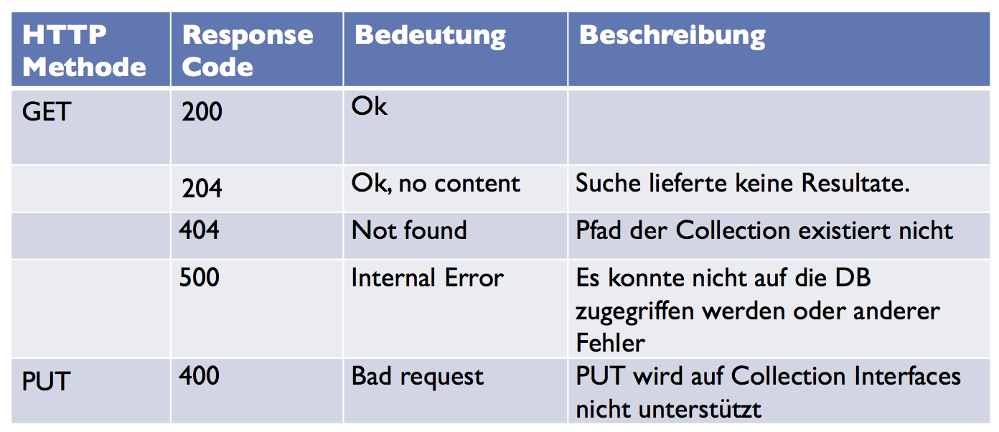

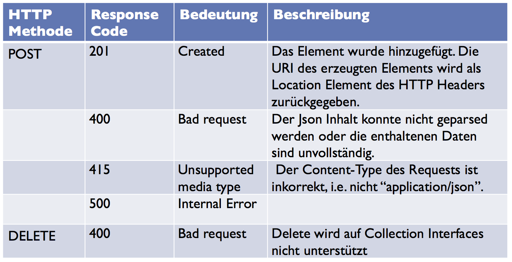

* Return Codes für Elemente

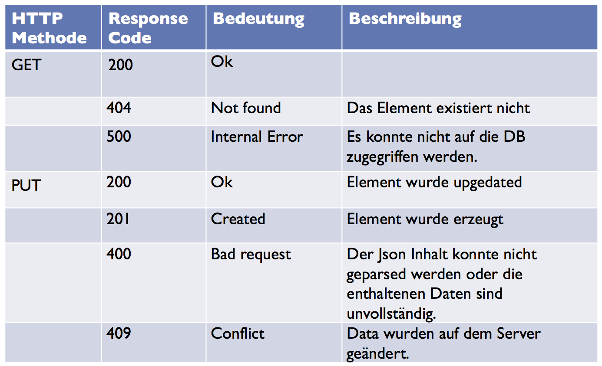

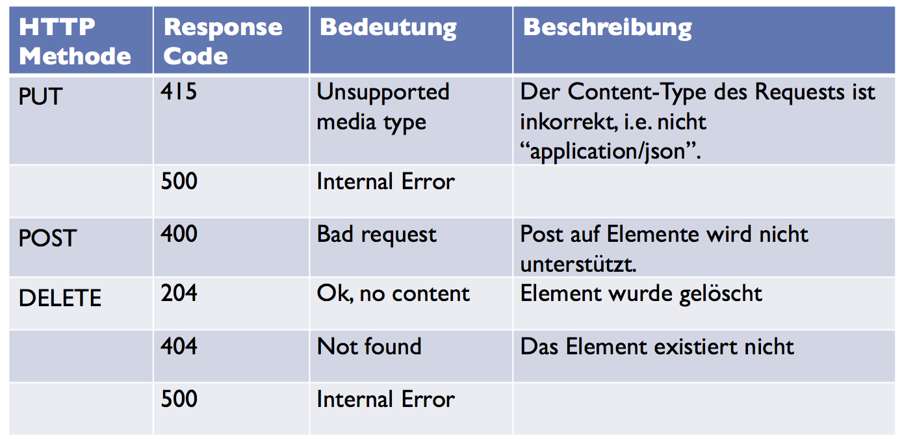


# Sicherheit: Authentifizierung

* Top 10 Mistakes Software Architecture: 9. Do-It-Yourself Security

## Optionen

* JWT
* OAuth 2.0

## Use Cases

* Authentifizierung für Zugriff aus Web Apps
* Authentifizierung für Zugriff auf WebServices
* Anbindung an andere Provider (FB, Google)

## Basis Auth

* Username + Passwort mit jedem HTTP Request mitgeschickt
* Nicht wirklich **secure**

## Digest Auth

### Idee

* Passwort nicht mitgeschickt, nur der "Digest" (MD5 checksum)
* Server verwendet zusätzlich **none** und **opaque** Wert

### Implementation

1. Client greift auf URI
2. Server fordert Auth für Bereich
3. Schickt **none** und **opaque**
4. Client berechnet Digests und fügt sie dem Request hinzu
5. Server prüft Digest
6. Falls erfolgreich wird Zugriff gewährt

### Elemente

* response: Berechneter Digest Wert
* username: Benutzername
* uri: URI (wiederholt wegen Proxies)
* gop: Quality of Service. Eine der vom Server gegebenen Alternativen
* cnonce: nonce vom Client
* nc: Anzahl Requests die Client mit diesem Nonce geschickt hat

## JWT

Json Web Tokens:

* Sichere Übertragung von JSON Objekte
* Basiert auf Standard (RFC7519)
* Header, Payload, Signature

**JWT Header**: JSON Format, gibt algorithmus an (HS256, RS256, ES256)<br>
**JWT Payload**: Benutzerdefinierte Attribute<br>
**JWT Signature**: Signature über Header und Payload<br>
**Token**: String mit Header, Payload und Signature durch `.` getrennt

## OAuth 2.0

* Ermöglich third-party apps Zugriff auf HTTP services zu erhalten

## Basic Flow

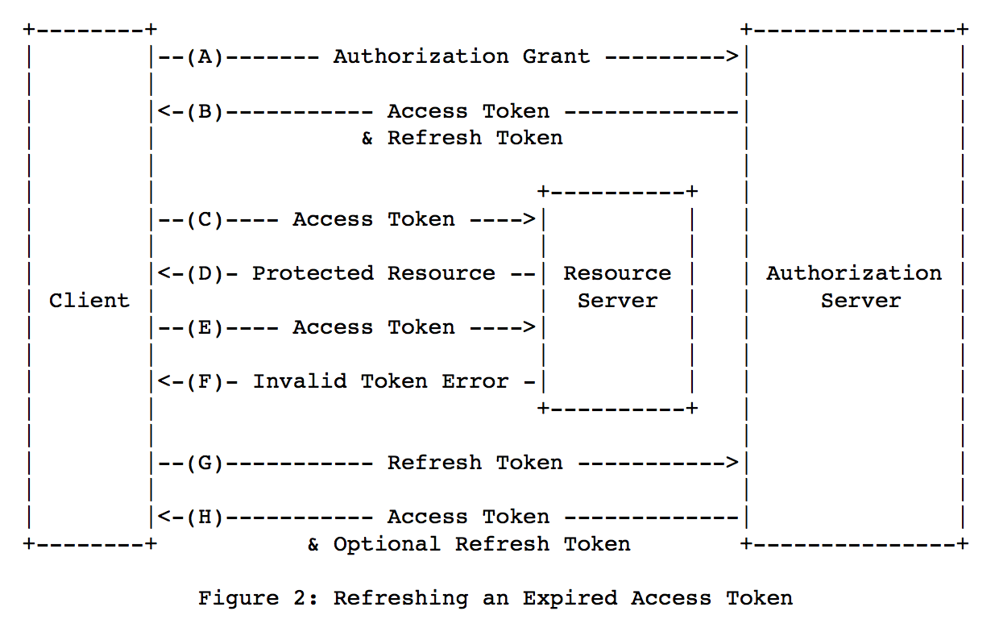

## Rollen

* Resource Owner
* Resource Server
* Client: 3rdParty Anwendung
* Authorization Server

## Client Types

* confidential: kann Passwort sicher speichern
* public: kann Passwort **nicht** sicher speichern

# NODE.JS

Beides Server-Sprachen.

> * Node.js® is a JavaScript runtime built on Chrome's V8 JavaScript engine. 

## Eigenschaften

* JS runtime
* Asynchronous, event driven
* single threaded design (event loop)
* scalable
* leichtgewichtig
* Unterstützt Module

## Buffer

* Für binäre Daten
* Notwendig für Server
* Oft mit Streams

## Event Loop

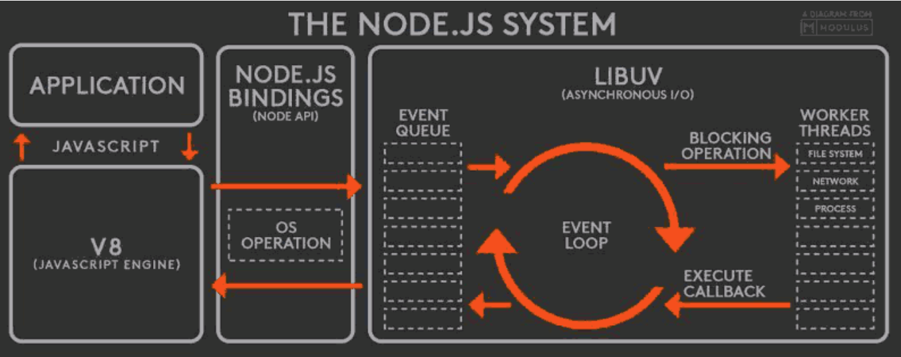

## Blocking / Non-Blocking

* Blocking (Synchron):

```js
const fs = require('fs');
const data = fs.readFileSync('/file.md'); 
console.log(data);
// moreWork(); will run after console.log
```

* Non-Blocking (Asynchron):

```js
const fs = require('fs'); 
fs.readFile('/file.md', (err, data) => {
  	if (err) throw err;
	console.log(data); 
});
// moreWork(); will run before console.log;
```

## Express

> Fast, unopinionated, minimalist web framework for Node.js

## Middleware

Ziel: Verarbeitung des Requests über mehrere Stufen

Aufgaben:

* Code Ausführen
* Änderungen an den Request / Response Objekten
* Beenden des Request / Response Zyklus, oder
* Weiterleiten an die nächste Middleware

Beispiel Loggen von jedem Request:

```js
var myLogger = function (req, res, next) { 
	console.log('LOGGED');
	next(); 
};

app.use(myLogger);

app.get('/', function (req, res) {
	res.send('Hello World!'); 
});

app.listen(3000);
```

