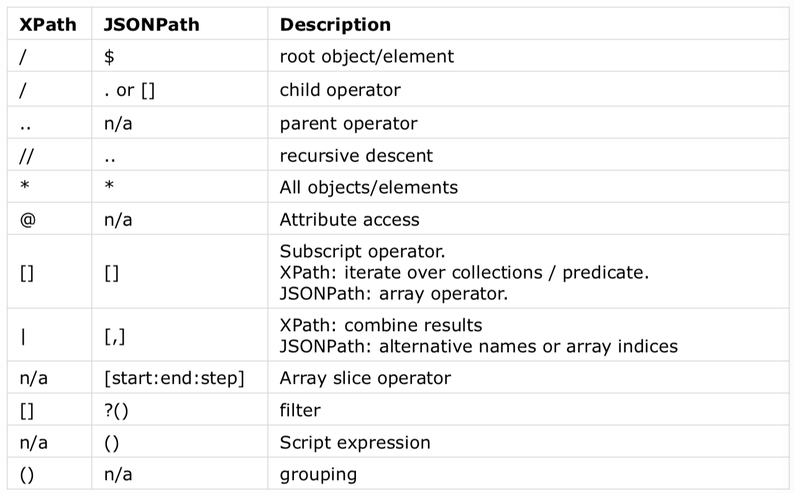

# JSONPath

## What is JSONPath

* Similar to XPath for XML
* a string that is used to select objects at a number of points within the flow
* a query is run on a JSON object and will return the first match

## JSONPath Notation

* dot notation: `$.movies[0].title`
* bracked notation: `$['movies'][0]['title']`
* `$` represents root object
* if root JSON object not existant, refer to implicit root object
* case-sensitive

## JSONPath Operators

* `$` : root node
* `@` : current node $$\to$$  `$.movies[?(@.year==2015)].title`
* `*` : wildcard $$\to​$$  `$.movies.*.bondGirl` 
* `.` : child member 
* `..` : recursive descendant $$\to$$  `$.movies..duration` 
* no operators to access parent or sibling from given node (unlike XPath)

## JSONPath Array Operators

* `[n]` : n-th element of an array (0-based)
* `[n, m, o, ...]` : list of array elements of specified indices
* `[start​:end:​step]` : list of array elements from start to end index (end not included)
* `[start:]` : list of all array elements from start until end of array
* `[:n]` : list of first `n` array elements
* `[-n:]` : list of last `n` array elements

> some only work with Goessner and some only with Jayway!

## JSONPath Filters

* `[?(expression)]` : Syntax
* `==`, `!=`, `>`, `>=`, `<`, `<=` : Comparison
* `=~` : RegEx
* `&&`, `||` : Logical operators
* `in`, `nin` : Inclusion, exclusion
* `subsetof` : Check if array is subset of another array:
* `size` : size should match
* `empty` : should be empty
* Example1: `$..book[?(@.category == 'fiction')]`
* Example2: `$.movies[?(@.bond nin ['George Lazenby'])]`

## JSONPath Functions

* end of path, applied on output of path expression
* `min()` : min value of array of numbers as **double**s
* `max()` : max value of array of **double**s
* `avg()` : average value of array of **double**s
* `stddev()` : start of deviation of array of **double**s
* `length()` : length of array as **integer**

## JSONPath vs. XPath

* XPath uses `1` as first index
* JSONPath uses `0` as first index
* JSONPath function only applicable to values, not result sets
* JSONPath limited compared to XPath (nested path expression, aggregate funct., ...)

